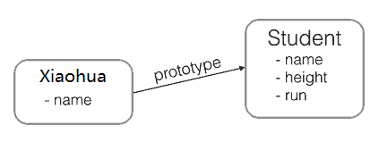
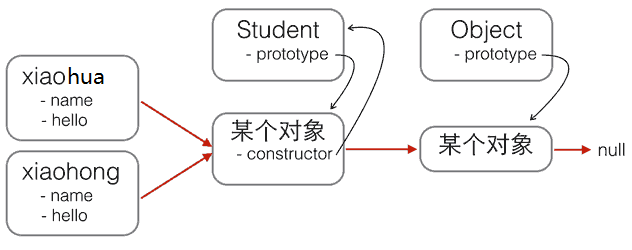
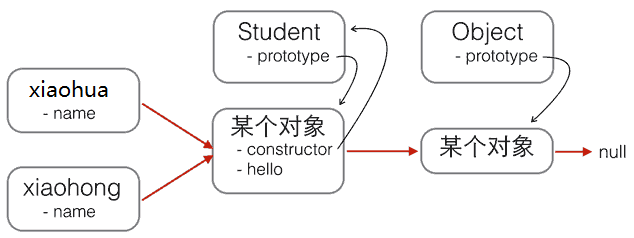

# 高阶函数

高阶函数英文叫Higher-order function。JavaScript的函数其实都指向某个变量，如果一个函数就可以接收另一个函数作为参数，这种函数就称之为高阶函数。

一个最简单的高阶函数：

```javascript
function add(x, y, f) {
    return f(x) + f(y);
}
var x = add(-5, 6, Math.abs);
console.log(x); // 11
```

 编写高阶函数，就是让函数的参数能够接收别的函数。 

## map

比如要把函数$f(x)=x^2$作用在数组`[1, 2, 3, 4, 5, 6, 7, 8, 9]`上，就可以用`map`实现如下：


`Array`对象内置了`map()`方法：

```javascript
'use strict';

const pow = x => Math.pow(x,2);
var arr = [1, 2, 3, 4, 5, 6, 7, 8, 9];
var results = arr.map(pow); 
console.log(results); // [1, 4, 9, 16, 25, 36, 49, 64, 81]
```

把`Array`的所有数字转为字符串：

```javascript
var arr = [1, 2, 3, 4, 5, 6, 7, 8, 9];
var results = arr.map(String); // ['1', '2', '3', '4', '5', '6', '7', '8', '9']
console.log(results);
```

## reduce

Array的`reduce()`把一个函数作用在这个`Array`的`[x1, x2, x3...]`上，这个函数必须接收两个参数，`reduce()`把结果继续和序列的下一个元素做累积计算，其效果就是：

```javascript
[x1, x2, x3, x4].reduce(f) = f(f(f(x1, x2), x3), x4)
```

比方说对一个`Array`求和，就可以用`reduce`实现：

```javascript
var arr = [1, 3, 5, 7, 9];
arr.reduce(function (x, y) {
    return x + y;
}); // 25
```

把`[1, 3, 5, 7, 9]`变换成整数13579，`reduce()`也能派上用场：

```javascript
var arr = [1, 3, 5, 7, 9];
arr.reduce(function (x, y) {
    return x * 10 + y;
}); // 13579
```

 利用map和reduce操作实现一个`string2int()`函数： 

```javascript
'use strict';

function string2int(s) {
    return s.split("").map(x => x*1).reduce((x,y) => x*10 + y)
}
```

## map遇到的问题

map的语法：

```javascript
array.map(function(currentValue,index,arr), thisValue)
```

- *currentValue*： 当前元素的值 
- *index* ： 当前元素的索引值 
- *arr* ： 前元素属于的数组对象
- thisValue：用作 "this" 的值。如果省略了 thisValue，或者传入 null、undefined，那么回调函数的 this 为全局对象。 

利用`map()`把字符串变成整数 :

```javascript
var arr = ['1', '2', '3'];
var r = arr.map(parseInt);
console.log(r);
//结果却是1, NaN, NaN
```

这是因为parseInt接受两个参数`(string, radix)`，第二个参数指定被转换的“数字”多少进制。

当`arr = [1,2,3]`时，`arr.map(parseInt)`实际为：

```javascript
parseInt('1', 0);  // 按十进制转换'1'
parseInt('2', 1);  // 按一进制转换'2'，但一进制中只有0没有1
parseInt('3', 2);  // 按二进制转换3，但二进制中只有0和1没有2
```

解决办法：

```javascript
var arr = ['1', '2', '3'];
var r = arr.map(str=>parseInt(str));
console.log(r);
// 结果:1,2,3
```

## filter

filter用于把`Array`的某些元素过滤掉，然后返回剩下的元素。

`filter()`把传入的函数依次作用于每个元素，然后根据返回值是`true`还是`false`决定保留还是丢弃该元素。

例如，在一个`Array`中，删掉偶数，只保留奇数，可以这么写：

```javascript
var arr = [1, 2, 4, 5, 6, 9, 10, 15];
var r = arr.filter(function (x) {
    return x % 2 !== 0;
});
r; // [1, 5, 9, 15]
```

把一个`Array`中的空字符串删掉，可以这么写：

```javascript
var arr = ['A', '', 'B', null, undefined, 'C', '  '];
var r = arr.filter(function (s) {
    return s && s.trim(); // 注意：IE9以下的版本没有trim()方法
});
r; // ['A', 'B', 'C']
```

`filter()`接收的回调函数，其实可以有多个参数。通常我们仅使用第一个参数，表示`Array`的某个元素。回调函数还可以接收另外两个参数，表示元素的位置和数组本身：

```javascript
var arr = ['A', 'B', 'C'];
var r = arr.filter(function (element, index, self) {
    console.log(element); // 依次打印'A', 'B', 'C'
    console.log(index); // 依次打印0, 1, 2
    console.log(self); // self就是变量arr
    return true;
});
```

## sort

`Array`的`sort()`方法，默认把所有元素先转换为String再排序，结果导致：

```javascript
// 看上去正常的结果:
['Google', 'Apple', 'Microsoft'].sort(); // ['Apple', 'Google', 'Microsoft'];

// apple排在了最后:
['Google', 'apple', 'Microsoft'].sort(); // ['Google', 'Microsoft", 'apple']

// 无法理解的结果:
[10, 20, 1, 2].sort(); // [1, 10, 2, 20]
```

幸运的是，`sort()`方法也是一个高阶函数，它还可以接收一个比较函数来实现自定义的排序。

比较的过程必须通过函数抽象出来。通常规定，对于两个元素`x`和`y`，如果认为`x < y`，则返回`-1`，如果认为`x == y`，则返回`0`，如果认为`x > y`，则返回`1`，这样，排序算法就不用关心具体的比较过程，而是根据比较结果直接排序。

```javascript
[10, 20, 1, 2].sort((x,y)=>x-y); // 1,2,10,20
[10, 20, 1, 2].sort((x,y)=>y-x); // [20, 10, 2, 1]
```

忽略大小写排序：

```javascript
var arr = ['Google', 'apple', 'Microsoft'];
arr.sort(function (s1, s2) {
    x1 = s1.toUpperCase();
    x2 = s2.toUpperCase();
    if (x1 < x2) {
        return -1;
    }
    if (x1 > x2) {
        return 1;
    }
    return 0;
}); // ['apple', 'Google', 'Microsoft']
```

`sort()`方法会直接对`Array`进行修改，它返回的结果仍是当前`Array`：

```javascript
var a1 = ['B', 'A', 'C'];
var a2 = a1.sort();
a1; // ['A', 'B', 'C']
a2; // ['A', 'B', 'C']
a1 === a2; // true, a1和a2是同一对象
```

## every

`every()`方法可以判断数组的所有元素是否满足测试条件。

例如，给定一个包含若干字符串的数组，判断所有字符串是否满足指定的测试条件：

```javascript
var arr = ['Apple', 'pear', 'orange'];
console.log(arr.every(function (s) {
    return s.length > 0;
})); // true, 因为每个元素都满足s.length>0

console.log(arr.every(function (s) {
    return s.toLowerCase() === s;
})); // false, 因为不是每个元素都全部是小写
```

## find

`find()`方法用于查找符合条件的第一个元素，如果找到了，返回这个元素，否则，返回`undefined`：

```javascript
var arr = ['Apple', 'pear', 'orange'];
console.log(arr.find(function (s) {
    return s.toLowerCase() === s;
})); // 'pear', 因为pear全部是小写

console.log(arr.find(function (s) {
    return s.toUpperCase() === s;
})); // undefined, 因为没有全部是大写的元素
```

## findIndex

`findIndex()`和`find()`类似，也是查找符合条件的第一个元素，不同之处在于`findIndex()`会返回这个元素的索引，如果没有找到，返回`-1`：

```javascript
var arr = ['Apple', 'pear', 'orange'];
console.log(arr.findIndex(function (s) {
    return s.toLowerCase() === s;
})); // 1, 因为'pear'的索引是1

console.log(arr.findIndex(function (s) {
    return s.toUpperCase() === s;
})); // -1
```

## forEach

`forEach()`和`map()`类似，它也把每个元素依次作用于传入的函数，但不会返回新的数组。`forEach()`常用于遍历数组，因此，传入的函数不需要返回值：

```javascript
var arr = ['Apple', 'pear', 'orange'];
arr.forEach(console.log); // 依次打印每个元素
```

# generator

generator（生成器）是ES6标准引入的新的数据类型。一个generator看上去像一个函数，但可以返回多次。

generator跟函数很像，定义如下：

```javascript
function* foo(x) {
    yield x + 1;
    yield x + 2;
    return x + 3;
}
```

generator和函数不同的是，generator由`function*`定义（注意多出的`*`号），并且，除了`return`语句，还可以用`yield`返回多次。

以一个著名的斐波那契数列为例，它由`0`，`1`开头：

```
0 1 1 2 3 5 8 13 21 34 ...
```

要编写一个产生斐波那契数列的函数，可以这么写：

```javascript
function fib(max) {
    var
        a = 0,
        b = 1,
        arr = [0, 1];
    while (arr.length < max) {
        [a, b] = [b, a + b];
        arr.push(b);
    }
    return arr;
}

// 测试:
fib(5); // [0, 1, 1, 2, 3]
fib(10); // [0, 1, 1, 2, 3, 5, 8, 13, 21, 34]
```

函数只能返回一次，所以必须返回一个`Array`。但是，如果换成generator，就可以一次返回一个数，不断返回多次。用generator改写如下：

```javascript
function* fib(max) {
    var
        a = 0,
        b = 1,
        n = 0;
    while (n < max) {
        yield a;
        [a, b] = [b, a + b];
        n ++;
    }
    return;
}
```

直接调用一个generator和调用函数不一样，`fib(5)`仅仅是创建了一个generator对象，还没有去执行它：

```javascript
fib(5); // fib {[[GeneratorStatus]]: "suspended", [[GeneratorReceiver]]: Window}
```

调用generator对象有两个方法，一是不断地调用generator对象的`next()`方法：

```javascript
var f = fib(5);
f.next(); // {value: 0, done: false}
f.next(); // {value: 1, done: false}
f.next(); // {value: 1, done: false}
f.next(); // {value: 2, done: false}
f.next(); // {value: 3, done: false}
f.next(); // {value: undefined, done: true}
```

`next()`方法会执行generator的代码，然后，每次遇到`yield x;`就返回一个对象`{value: x, done: true/false}`，然后“暂停”。返回的`value`就是`yield`的返回值，`done`表示这个generator是否已经执行结束了。如果`done`为`true`，则`value`就是`return`的返回值。

当执行到`done`为`true`时，这个generator对象就已经全部执行完毕，不要再继续调用`next()`了。

第二个方法是直接用`for ... of`循环迭代generator对象，这种方式不需要自己判断`done`：

```javascript
for (var x of fib(10)) {
    console.log(x); // 依次输出0, 1, 1, 2, 3, ...
}
```

## generator简化AJAX

没有generator之前，用AJAX时需要这么写代码：

```javascript
ajax('http://url-1', data1, function (err, result) {
    if (err) {
        return handle(err);
    }
    ajax('http://url-2', data2, function (err, result) {
        if (err) {
            return handle(err);
        }
        ajax('http://url-3', data3, function (err, result) {
            if (err) {
                return handle(err);
            }
            return success(result);
        });
    });
});
```

回调越多，代码越难看。

有了generator用AJAX时可以这么写：

```javascript
try {
    r1 = yield ajax('http://url-1', data1);
    r2 = yield ajax('http://url-2', data2);
    r3 = yield ajax('http://url-3', data3);
    success(r3);
}
catch (err) {
    handle(err);
}
```

 generator生成自增ID ：

```javascript
function* next_id() {
    var current_id = 0;
    while (true) {
        current_id++;
        yield current_id;
    }
}
```

# 标准对象

## Date

在JavaScript中，`Date`对象用来表示日期和时间。

要获取系统当前时间，用：

```javascript
var now = new Date();
now; // Wed Jun 24 2015 19:49:22 GMT+0800 (CST)
now.getFullYear(); // 2015, 年份
now.getMonth(); // 5, 月份，注意月份范围是0~11，5表示六月
now.getDate(); // 24, 表示24号
now.getDay(); // 3, 表示星期三
now.getHours(); // 19, 24小时制
now.getMinutes(); // 49, 分钟
now.getSeconds(); // 22, 秒
now.getMilliseconds(); // 875, 毫秒数
now.getTime(); // 1435146562875, 以number形式表示的时间戳
```

注意，当前时间是浏览器从本机操作系统获取的时间，所以不一定准确，因为用户可以把当前时间设定为任何值。

如果要创建一个指定日期和时间的`Date`对象，可以用：

```javascript
var d = new Date(2015, 5, 19, 20, 15, 30, 123);
d; // Fri Jun 19 2015 20:15:30 GMT+0800 (CST)
```

 JavaScript的Date对象月份值从0开始，0=1月，1=2月，2=3月，……，11=12月。

第二种创建一个指定日期和时间的方法是解析一个符合[ISO 8601](http://www.w3.org/TR/NOTE-datetime)格式的字符串：

```javascript
var d = Date.parse('2015-06-24T19:49:22.875+08:00');
d; // 1435146562875
```

它返回一个时间戳，时间戳转换为`Date`：

```javascript
var d = new Date(1435146562875);
d; // Wed Jun 24 2015 19:49:22 GMT+0800 (CST)
d.getMonth(); // 5
```

 使用Date.parse()时传入的字符串使用实际月份01~12，转换为Date对象后getMonth()获取的月份值为0~11。

时间戳是一个自增的整数，它表示从1970年1月1日零时整的GMT时区开始的那一刻，到现在的毫秒数。

`Date`对象表示的时间总是按浏览器所在时区显示的，既可以显示本地时间，也可以显示调整后的UTC时间：

```javascript
var d = new Date(1435146562875);
d.toLocaleString(); // '2015/6/24 下午7:49:22'，本地时间（北京时区+8:00），显示的字符串与操作系统设定的格式有关
d.toUTCString(); // 'Wed, 24 Jun 2015 11:49:22 GMT'，UTC时间，与本地时间相差8小时
```

要获取当前时间戳，可以用：

```javascript
console.log(Date.now()||new Date().getTime());
```

## JSON

| 函数             | 描述                                           |
| ---------------- | ---------------------------------------------- |
| JSON.parse()     | 用于将一个 JSON 字符串转换为 JavaScript 对象。 |
| JSON.stringify() | 用于将 JavaScript 值转换为 JSON 字符串。       |

 JSON字符串转JavaScript对象：

```javascript
var text = '{ "sites" : [' +
    '{ "name":"Google" , "url":"www.google.com" },' +
    '{ "name":"Taobao" , "url":"www.taobao.com" } ]}';
    
obj = JSON.parse(text);
document.getElementById("demo").innerHTML = obj.sites[1].name + " " + obj.sites[1].url;
```

JavaScript对象转字符串：

```javascript
var str = {"name":"淘宝", "site":"http://www.taobao.com"}
str_pretty1 = JSON.stringify(str)
document.write("<pre>" + str_pretty1 + "</pre><br/>" );

var str_pretty2 = JSON.stringify(str, null, 4) //使用四个空格缩进
document.write("<pre>" + str_pretty2 + "</pre>" ); // pre 用于格式化输出
```

## 正则表达式

语法:

```
/正则表达式模式/修饰符(可选)
```

其中修饰符是可选的。

**修饰符** 可以在全局搜索中不区分大小写:

| 修饰符 | 描述                                                     |
| :----- | :------------------------------------------------------- |
| i      | 执行对大小写不敏感的匹配。                               |
| g      | 执行全局匹配（查找所有匹配而非在找到第一个匹配后停止）。 |
| m      | 执行多行匹配。                                           |

**正则表达式模式**

方括号用于查找某个范围内的字符：

| 表达式 | 描述                       |
| :----- | :------------------------- |
| [abc]  | 查找方括号之间的任何字符。 |
| [0-9]  | 查找任何从 0 至 9 的数字。 |
| (x\|y) | 查找任何以 \| 分隔的选项。 |

元字符是拥有特殊含义的字符：

| 元字符 | 描述                                        |
| :----- | :------------------------------------------ |
| \d     | 查找数字。                                  |
| \s     | 查找空白字符。                              |
| \b     | 匹配单词边界。                              |
| \uxxxx | 查找以十六进制数 xxxx 规定的 Unicode 字符。 |

量词:

| 量词 | 描述                                  |
| :--- | :------------------------------------ |
| n+   | 匹配任何包含至少一个 *n* 的字符串。   |
| n*   | 匹配任何包含零个或多个 *n* 的字符串。 |
| n?   | 匹配任何包含零个或一个 *n* 的字符串。 |

 RegExp 对象是一个预定义了属性和方法的正则表达式对象。 

test() 方法用于检测一个字符串是否匹配某个模式，如果字符串中含有匹配的文本，则返回 true，否则返回 false。

exec() 方法用于检索字符串中的正则表达式的匹配。该函数返回一个数组，其中存放匹配的结果。如果未找到匹配，则返回值为 null。

```javascript
/e/.test("The best things in life are free!");
//或
RegExp("e").test("The best things in life are free");
//true
/e/.exec("The best things in life are free!");
//或
RegExp("e").exec("The best things in life are free");
//e
```

### 分组

除了简单地判断是否匹配之外，正则表达式还有提取子串的强大功能。用`()`表示的就是要提取的分组（Group）。比如：

`^(\d{3})-(\d{3,8})$`分别定义了两个组，可以直接从匹配的字符串中提取出区号和本地号码：

```javascript
var re = /^(\d{3})-(\d{3,8})$/;
re.exec('010-12345'); // ['010-12345', '010', '12345']
re.exec('010 12345'); // null
```

如果正则表达式中定义了组，就可以在`RegExp`对象上用`exec()`方法提取出子串来。

`exec()`方法在匹配成功后，会返回一个`Array`，第一个元素是正则表达式匹配到的整个字符串，后面的字符串表示匹配成功的子串。

`exec()`方法在匹配失败时返回`null`。

### 贪婪匹配

需要特别指出的是，正则匹配默认是贪婪匹配，也就是匹配尽可能多的字符。举例如下，匹配出数字后面的`0`：

```javascript
var re = /^(\d+)(0*)$/;
re.exec('102300'); // ['102300', '102300', '']
```

由于`\d+`采用贪婪匹配，直接把后面的`0`全部匹配了，结果`0*`只能匹配空字符串了。

必须让`\d+`采用非贪婪匹配（也就是尽可能少匹配），才能把后面的`0`匹配出来，加个`?`就可以让`\d+`采用非贪婪匹配：

```javascript
var re = /^(\d+?)(0*)$/;
re.exec('102300'); // ['102300', '1023', '00']
```

# JavaScript面向对象

JavaScript不区分类和实例的概念，而是通过原型（prototype）来实现面向对象编程。

原型是指当我们想要创建`xiaohua`这个具体的学生时，把`xiaohua`的原型指向了对象`Student`：

```javascript
var Student = {
    name: 'Robot',
    height: 1.2,
    run: function () {
        console.log(this.name + ' is running...');
    }
};

var xiaohua = {
    name: '小华'
};

xiaohua.__proto__ = Student;
```

看上去`xiaohua`仿佛是从`Student`继承下来的：

```javascript
xiaohua.name; // '小华'
xiaohua.run(); // 小华 is running...
```

`xiaohua`有自己的`name`属性，但并没有定义`run()`方法。不过，由于小华是从`Student`继承而来，只要`Student`有`run()`方法，`xiaohua`也可以调用：



JavaScript的原型链和Java的Class区别就在，它没有“Class”的概念，所有对象都是实例，所谓继承关系不过是把一个对象的原型指向另一个对象而已。

如果把`xiaohua`的原型指向其他对象：

```javascript
var Bird = {
    fly: function () {
        console.log(this.name + ' is flying...');
    }
};

xiaohua.__proto__ = Bird;
```

现在`xiaohua`已经无法`run()`了，他已经变成了一只鸟：

```javascript
xiaohua.fly(); // 小华 is flying...
```

在JavaScrip代码运行时期，你可以把`xiaohua`从`Student`变成`Bird`，或者变成任何对象。

还可以通过`Object.create()`方法可以传入一个原型对象，并创建一个基于该原型的新对象，但是新对象什么属性都没有，可以编写一个函数来创建`xiaohua`：

```javascript
// 原型对象:
var Student = {
    name: 'Robot',
    height: 1.2,
    run: function () {
        console.log(this.name + ' is running...');
    }
};

function createStudent(name) {
    // 基于Student原型创建一个新对象:
    var s = Object.create(Student);
    // 初始化新对象:
    s.name = name;
    return s;
}

var xiaohua = createStudent('小华');
xiaohua.run(); // 小华 is running...
xiaohua.__proto__ === Student; // true
```

## 创建对象

JavaScript对每个创建的对象都会设置一个原型，指向它的原型对象。

当用`obj.xxx`访问一个对象的属性时，JavaScript引擎先在当前对象上查找该属性，如果没有找到，就到其原型对象上找，如果还没有找到，就一直上溯到`Object.prototype`对象，最后，如果还没有找到，就只能返回`undefined`。

`Array`对象的原型链是：

```javascript
var arr = [1, 2, 3];
arr ----> Array.prototype ----> Object.prototype ----> null
```

`Array.prototype`定义了`indexOf()`、`shift()`等方法，因此可以在所有的`Array`对象上直接调用这些方法。

函数的原型链是：

```javascript
function foo() {
    return 0;
}
foo ----> Function.prototype ----> Object.prototype ----> null
```

由于`Function.prototype`定义了`apply()`等方法，因此，所有函数都可以调用`apply()`方法。

如果原型链很长，那么访问一个对象的属性就会因为花更多的时间查找而变得更慢，因此要注意不要把原型链搞得太长。

### 构造函数创建对象

除了直接用`{ ... }`创建一个对象外，JavaScript还可以用一种构造函数的方法来创建对象。它的用法是，先定义一个构造函数：

```javascript
function Student(name) {
    this.name = name;
    this.hello = function () {
        alert('Hello, ' + this.name + '!');
    }
}
```

这虽然是一个普通函数，但在JavaScript中，可以用关键字`new`来调用这个函数，并返回一个对象：

```javascript
var xiaohua = new Student('小华');
xiaohua.name; // '小华'
xiaohua.hello(); // Hello, 小华!
```

**注意：**如果不写`new`，这就是一个普通函数，它返回`undefined`。但是，如果写了`new`，它就变成了一个构造函数，它绑定的`this`指向新创建的对象，并默认返回`this`，也就是说，不需要在最后写`return this;`。

新创建的`xiaohua`的原型链是：

```javascript
xiaohua ----> Student.prototype ----> Object.prototype ----> null
```

如果又创建了`xiaohong`、`xiaojun`，这些对象的原型也会指向函数`Student`的原型 ：

```
xiaohua ↘
xiaohong -→ Student.prototype ----> Object.prototype ----> null
xiaojun  ↗
```

用`new Student()`创建的对象还从原型上获得了一个`constructor`属性，它指向函数`Student`本身：

```javascript
xiaohua.constructor === Student.prototype.constructor; // true
Student.prototype.constructor === Student; // true

Object.getPrototypeOf(xiaohua) === Student.prototype; // true

xiaohua instanceof Student; // true
```

具体关系：



红色箭头是原型链，`Student.prototype`指向`xiaohua`、`xiaohong`的原型对象，这个原型对象自己还有个属性`constructor`，指向`Student`函数本身。

`xiaohua`、`xiaohong`对象虽然没有`prototype`属性，但可以用`__proto__`这个非标准用法来查看。

### 共享对象方法

上图的原型链有一个小问题：

```javascript
xiaohua.name; // '小华'
xiaohong.name; // '小红'
xiaohua.hello; // function: Student.hello()
xiaohong.hello; // function: Student.hello()
xiaohua.hello === xiaohong.hello; // false
```

`xiaohua`和`xiaohong`各自的`hello`是两个不同的函数，而这些对象的`hello`函数实际上只需要共享同一个函数就可以了，这样可以节省很多内存。

要让创建的对象共享一个`hello`函数，只要把`hello`函数移动到`xiaohua`、`xiaohong`这些对象共同的原型`Student.prototype`上就可以了：



修改代码如下即可：

```javascript
function Student(name) {
    this.name = name;
}

Student.prototype.hello = function () {
    alert('Hello, ' + this.name + '!');
};
```

### 对象构造器

还可以编写一个`createStudent()`函数，在内部封装所有的`new`操作。一个常用的编程模式像这样：

```javascript
function Student(props) {
    this.name = props.name || '匿名'; // 默认值为'匿名'
    this.grade = props.grade || 1; // 默认值为1
}

Student.prototype.hello = function () {
    alert('Hello, ' + this.name + '!');
};

function createStudent(props) {
    return new Student(props || {})
}
```

这个`createStudent()`函数有几个巨大的优点：一是不需要`new`来调用，二是参数非常灵活，可以不传，也可以这么传：

```javascript
var xiaohua = createStudent({
    name: '小华'
});

xiaohua.grade; // 1
```

如果创建的对象有很多属性，只需要传递需要的某些属性，剩下的属性可以用默认值。由于参数是一个Object，无需记忆参数的顺序。如果恰好从`JSON`拿到了一个对象，就可以直接创建出`xiaohua`。

## 继承

### 原型继承

要基于`Student`扩展出`PrimaryStudent`，可以先定义出`PrimaryStudent`：

```javascript
function PrimaryStudent(props) {
    // 调用Student构造函数，绑定this变量:
    Student.call(this, props);
    this.grade = props.grade || 1;
}
```

但是，调用了`Student`构造函数不等于继承了`Student`，`PrimaryStudent`创建的对象的原型是：

```javascript
new PrimaryStudent() ----> PrimaryStudent.prototype ----> Object.prototype ----> null
```

必须想办法把原型链修改为：

```javascript
new PrimaryStudent() ----> PrimaryStudent.prototype ----> Student.prototype ----> Object.prototype ----> null
```

必须借助一个中间对象才能实现正确的原型链，中间对象可以用一个空函数`F`来实现，中间对象的原型要指向`Student.prototype`：

```javascript
// PrimaryStudent构造函数:
function PrimaryStudent(props) {
    Student.call(this, props);
    this.grade = props.grade || 1;
}

// 空函数F:
function F() {
}

// 把F的原型指向Student.prototype:
F.prototype = Student.prototype;

// 把PrimaryStudent的原型指向一个新的F对象，F对象的原型正好指向Student.prototype:
PrimaryStudent.prototype = new F();

// 把PrimaryStudent原型的构造函数修复为PrimaryStudent:
PrimaryStudent.prototype.constructor = PrimaryStudent;

// 继续在PrimaryStudent原型（就是new F()对象）上定义方法：
PrimaryStudent.prototype.getGrade = function () {
    return this.grade;
};

// 创建xiaoming:
var xiaoming = new PrimaryStudent({
    name: '小明',
    grade: 2
});
xiaoming.name; // '小明'
xiaoming.grade; // 2

// 验证原型:
xiaoming.__proto__ === PrimaryStudent.prototype; // true
xiaoming.__proto__.__proto__ === Student.prototype; // true

// 验证继承关系:
xiaoming instanceof PrimaryStudent; // true
xiaoming instanceof Student; // true
```

新的原型链：


函数`F`仅用于桥接，改为任何名字都可以。

可以把继承这个动作用一个`inherits()`函数封装起来，简化代码：

```javascript
function inherits(Child, Parent) {
    var F = function () {};
    F.prototype = Parent.prototype;
    Child.prototype = new F();
    Child.prototype.constructor = Child;
}
```

这个`inherits()`函数可以复用：

```javascript
function Student(props) {
    this.name = props.name || 'Unnamed';
}

Student.prototype.hello = function () {
    alert('Hello, ' + this.name + '!');
}

function PrimaryStudent(props) {
    Student.call(this, props);
    this.grade = props.grade || 1;
}

// 实现原型继承链:
inherits(PrimaryStudent, Student);

// 绑定其他方法到PrimaryStudent原型:
PrimaryStudent.prototype.getGrade = function () {
    return this.grade;
};
```

总之，JavaScript的原型继承实现方式就是：

1. 定义新的构造函数，并在内部用`call()`调用希望“继承”的构造函数，并绑定`this`；
2. 借助中间函数`F`实现原型链继承，最好通过封装的`inherits`函数完成；
3. 继续在新的构造函数的原型上定义新方法。

### class继承

`class`从ES6开始正式被引入到JavaScript中。`class`的目的就是让定义类更简单。

如果用新的`class`关键字来编写`Student`，可以这样写：

```javascript
class Student {
    constructor(name) {
        this.name = name;
    }
    hello() {
        alert('Hello, ' + this.name + '!');
    }
}
```

相当于：

```javascript
function Student(name) {
    this.name = name;
}
Student.prototype.hello = function () {
    alert('Hello, ' + this.name + '!');
}
```

`class`的定义包含了构造函数`constructor`和定义在原型对象上的函数`hello()`，这样就避免了`Student.prototype.hello = function () {...}`这样分散的代码。

现在从`Student`派生一个`PrimaryStudent`可直接通过`extends`来实现：

```javascript
class PrimaryStudent extends Student {
    constructor(name, grade) {
        super(name); // 记得用super调用父类的构造方法!
        this.grade = grade;
    }
    myGrade() {
        alert('I am at grade ' + this.grade);
    }
}
```

利用`class`定义`Cat`，并让它从已有的`Animal`继承，然后新增一个方法`say()`，返回字符串`'Hello, xxx!'`：

```javascript
'use strict';

class Animal {
    constructor(name) {
        this.name = name;
    }
}
class Cat extends Animal {
    constructor(name) {
    	super(name);
    }
    say(){
    	return `Hello, ${this.name}!`;
    }
}

```

# DOM

这里的DOM节点是指`Element`，但是DOM节点实际上是`Node`，在HTML中，`Node`包括`Element`、`Comment`、`CDATA_SECTION`等很多种，以及根节点`Document`类型，但是，绝大多数时候我们只关心`Element`，也就是实际控制页面结构的`Node`，其他类型的`Node`忽略即可。根节点`Document`已经自动绑定为全局变量`document`。 

## 常见的HTML事件

下面是一些常见的HTML事件的列表:

| 事件        | 描述                         |
| :---------- | :--------------------------- |
| onchange    | HTML 元素改变                |
| onclick     | 用户点击 HTML 元素           |
| onmouseover | 用户在一个HTML元素上移动鼠标 |
| onmouseout  | 用户从一个HTML元素上移开鼠标 |
| onkeydown   | 用户按下键盘按键             |
| onload      | 浏览器已完成页面的加载       |

## 常用浏览器对象

JavaScript可以获取浏览器提供的很多对象，并进行操作。

### window

`window`对象不但充当全局作用域，而且表示浏览器窗口。

`window`对象有`innerWidth`和`innerHeight`属性，可以获取浏览器窗口的内部宽度和高度。内部宽高是指除去菜单栏、工具栏、边框等占位元素后，用于显示网页的净宽高。

```javascript
console.log('window inner size: ' + window.innerWidth + ' x ' + window.innerHeight);
```

对应的，还有一个`outerWidth`和`outerHeight`属性，可以获取浏览器窗口的整个宽高。

考虑游览器的兼容性，可利用JavaScript对不存在属性返回`undefined`的特性，直接用短路运算符`||`计算：

```javascript
var width = window.innerWidth || document.body.clientWidth;
```

### navigator

`navigator`对象表示浏览器的信息，最常用的属性包括：

- navigator.appName：浏览器名称；
- navigator.appVersion：浏览器版本；
- navigator.language：浏览器设置的语言；
- navigator.platform：操作系统类型；
- navigator.userAgent：浏览器设定的`User-Agent`字符串。

### screen

`screen`对象表示屏幕的信息，常用的属性有：

- screen.width：屏幕宽度，以像素为单位；
- screen.height：屏幕高度，以像素为单位；
- screen.colorDepth：返回颜色位数，如8、16、24。

### location

`location`对象表示当前页面的URL信息。例如，一个完整的URL：

```
http://www.example.com:8080/path/index.html?a=1&b=2#TOP
```

可以用`location.href`获取。要获得URL各个部分的值，可以这么写：

```
location.protocol; // 'http'
location.host; // 'www.example.com'
location.port; // '8080'
location.pathname; // '/path/index.html'
location.search; // '?a=1&b=2'
location.hash; // 'TOP'
```

要加载一个新页面，可以调用`location.assign()`。如果要重新加载当前页面，可调用`location.reload()`方法。

### document

`document`对象表示当前页面。由于HTML在浏览器中以DOM形式表示为树形结构，`document`对象就是整个DOM树的根节点。

`document`的`title`属性是从HTML文档中的`xxx`读取的，但是可以动态改变：

```
document.title = '努力学习JavaScript!';
```

此时浏览器窗口的标题会发生变化。

要查找DOM树的某个节点，需要从`document`对象开始查找。最常用的查找是根据ID和Tag Name。

例如对于HTML数据：

```html
<dl id="drink-menu" style="border:solid 1px #ccc;padding:6px;">
    <dt>摩卡</dt>
    <dd>热摩卡咖啡</dd>
    <dt>酸奶</dt>
    <dd>北京老酸奶</dd>
    <dt>果汁</dt>
    <dd>鲜榨苹果汁</dd>
</dl>
```

用`document`对象提供的`getElementById()`和`getElementsByTagName()`可以按ID获得一个DOM节点和按Tag名称获得一组DOM节点：

```javascript
var menu = document.getElementById('drink-menu');
var drinks = document.getElementsByTagName('dt');
```

JavaScript可以通过`document.cookie`读取到当前页面的Cookie：

```javascript
document.cookie; // 'v=123; remember=true; prefer=zh'
```

由于JavaScript能读取到页面的Cookie，而用户的登录信息通常也存在Cookie中，这就造成了巨大的安全隐患，这是因为在HTML页面中引入第三方的JavaScript代码是允许的：

```html
<script src="http://www.foo.com/jquery.js"></script>
```

如果引入的第三方的JavaScript中存在恶意代码，则`www.foo.com`网站将直接获取到`www.example.com`网站的用户登录信息。

为了确保安全，服务器端在设置Cookie时，应该坚持使用`httpOnly`。设定了`httpOnly`的Cookie将不能被JavaScript读取。这个行为由浏览器实现，主流浏览器均支持`httpOnly`选项。只需cookie内容中含有`httpOnly`字段即可：

```javascript
document.cookie; // 'v=123; remember=true; prefer=zh; HTTPOnly;'
```

## 选取DOM

DOM是一个树形结构。操作一个DOM节点实际上就是这么几个操作：

- 更新：更新该DOM节点的内容，相当于更新了该DOM节点表示的HTML的内容；
- 遍历：遍历该DOM节点下的子节点，以便进行进一步操作；
- 添加：在该DOM节点下新增一个子节点，相当于动态增加了一个HTML节点；
- 删除：将该节点从HTML中删除，相当于删掉了该DOM节点的内容以及它包含的所有子节点。

在操作一个DOM节点前，需要通过各种方式先拿到这个DOM节点。一般方法是

- `document.getElementById()`：通过ID直接定位唯一的一个DOM节点
- `document.getElementsByTagName()`：通过标签名返回一组DOM节点
- `document.getElementsByClassName()`：通过类名返回一组DOM节点

要精确地选择DOM，可以先定位父节点，再从父节点开始选择，以缩小范围。

例如：

```javascript
// 返回ID为'test'的节点：
var test = document.getElementById('test');

// 先定位ID为'test-table'的节点，再返回其内部所有tr节点：
var trs = document.getElementById('test-table').getElementsByTagName('tr');

// 先定位ID为'test-div'的节点，再返回其内部所有class包含red的节点：
var reds = document.getElementById('test-div').getElementsByClassName('red');

// 获取节点test下的所有直属子节点:
var cs = test.children;

// 获取节点test下第一个、最后一个子节点：
var first = test.firstElementChild;
var last = test.lastElementChild;
```

更方便的方法是使用`querySelector()`和`querySelectorAll()`，传入CSS选择器来获取节点：

```javascript
// 通过querySelector获取ID为q1的节点：
var q1 = document.querySelector('#q1');

// 通过querySelectorAll获取q1节点内的符合条件的所有节点：
var ps = q1.querySelectorAll('div.highlighted > p');
```

对于html：

```html
<!-- HTML结构 -->
<div id="test-div">
	<div class="c-red">
        <p id="test-p">JavaScript</p>
        <p>Java</p>
    </div>
    <div class="c-red c-green">
        <p>Python</p>
        <p>Ruby</p>
        <p>Swift</p>
    </div>
    <div class="c-green">
        <p>Scheme</p>
        <p>Haskell</p>
    </div>
</div>
```

 选择出指定条件的节点： 

```javascript
// 选择<p>JavaScript</p>:
var js = document.querySelector('#test-p');

// 选择<p>Python</p>,<p>Ruby</p>,<p>Swift</p>:
var arr = document.querySelectorAll('#test-div > div.c-red.c-green > p');

// 选择<p>Haskell</p>:
var haskell = document.querySelector('#test-div > div.c-green:last-child > p:last-child');
```

### 常用CSS选择器

| 选择器                  | 示例                  | 示例说明                                                  |
| :---------------------- | :-------------------- | :-------------------------------------------------------- |
| `.class`                | .intro                | 选择所有class="intro"的元素                               |
| `#id`                   | #firstname            | 选择所有id="firstname"的元素                              |
| `*`                     | *                     | 选择所有元素                                              |
| `element`               | p                     | 选择所有p元素                                             |
| `element,element`       | div,p                 | 选择所有div元素和p元素                                    |
| `element element`       | div p                 | 选择div元素内的所有p元素                                  |
| `element > element`     | div>p                 | 选择所有父级是 div 元素的 p 元素                          |
| `element + element`     | div+p                 | 选择所有紧接着div元素之后的p元素                          |
| `element1~element2`     | p~ul                  | 选择p元素之后的每一个ul元素                               |
| `[attribute]`           | [target]              | 选择所有带有target属性元素                                |
| `[attribute=value]`     | [target=-blank]       | 选择所有使用target="-blank"的元素                         |
| `[attribute~=value]`    | [title~=flower]       | 选择标题属性包含单词"flower"的所有元素                    |
| `[attribute|=language]` | `[lang|=en]`          | 选择 lang 属性以 en 为开头的所有元素                      |
| :first-child            | p:first-child         | 指定只有当p元素是其父级的第一个子级的样式。               |
| :lang(language)         | p:lang(it)            | 选择一个lang属性的起始值="it"的所有p元素                  |
| `[attribute^=value]`    | a[src^="https"]       | 选择每一个src属性的值以"https"开头的元素                  |
| `[attribute$=value]`    | a[src$=".pdf"]        | 选择每一个src属性的值以".pdf"结尾的元素                   |
| `[attribute=value]`     | a[src="taobao"]       | 选择每一个src属性的值包含子字符串"taobao"的元素           |
| :first-of-type          | p:first-of-type       | 选择每个p元素是其父级的第一个p元素                        |
| :last-of-type           | p:last-of-type        | 选择每个p元素是其父级的最后一个p元素                      |
| :only-of-type           | p:only-of-type        | 选择每个p元素是其父级的唯一p元素                          |
| :only-child             | p:only-child          | 选择每个p元素是其父级的唯一子元素                         |
| :nth-child(n)           | p:nth-child(2)        | 选择每个p元素是其父级的第二个子元素                       |
| :nth-last-child(n)      | p:nth-last-child(2)   | 选择每个p元素的是其父级的第二个子元素，从最后一个子项计数 |
| :nth-of-type(n)         | p:nth-of-type(2)      | 选择每个p元素是其父级的第二个p元素                        |
| :nth-last-of-type(n)    | p:nth-last-of-type(2) | 选择每个p元素的是其父级的第二个p元素，从最后一个子项计数  |
| :last-child             | p:last-child          | 选择每个p元素是其父级的最后一个子级。                     |

## 更新DOM

拿到一个DOM节点后，可以直接修改节点的文本，修改`innerHTML`属性，可以直接通过HTML片段修改DOM节点内部的子树：

```javascript
// 获取<p id="p-id">...</p>
var p = document.getElementById('p-id');
// 设置文本为abc:
p.innerHTML = 'ABC'; // <p id="p-id">ABC</p>
// 设置HTML:
p.innerHTML = 'ABC <span style="color:red">RED</span> XYZ';
// <p>...</p>的内部结构已修改
```

用`innerHTML`时要注意，如果写入的字符串是通过网络拿到了，要注意对字符编码来避免XSS攻击。

第二种是修改`innerText`或`textContent`属性，这样可以自动对字符串进行HTML编码，保证无法设置任何HTML标签：

```javascript
// 获取<p id="p-id">...</p>
var p = document.getElementById('p-id');
// 设置文本:
p.innerText = '<script>alert("Hi")</script>';
// HTML被自动编码，无法设置一个<script>节点:
// <p id="p-id">&lt;script&gt;alert("Hi")&lt;/script&gt;</p>
```

两者的区别在于读取属性时，`innerText`不返回隐藏元素的文本，而`textContent`返回所有文本。

修改CSS也是经常需要的操作。DOM节点的`style`属性对应所有的CSS，可以直接获取或设置。因为CSS允许`font-size`这样的名称，但它并非JavaScript有效的属性名，所以需要在JavaScript中改写为驼峰式命名`fontSize`：

```javascript
// 获取<p id="p-id">...</p>
var p = document.getElementById('p-id');
// 设置CSS:
p.style.color = '#ff0000';
p.style.fontSize = '20px';
p.style.paddingTop = '2em';
```

## 插入DOM

如果某个DOM节点是空的，例如`<div></div>`，那直接使用`innerHTML = '<span>child</span>'`就可以修改DOM节点的内容，相当于“插入”了新的DOM节点。

### appendChild

如果这个DOM节点不是空的，可以使用`appendChild`，把一个子节点添加到父节点的最后一个子节点。例如：

```html
<!-- HTML结构 -->
<p id="js">JavaScript</p>
<div id="list">
    <p id="java">Java</p>
    <p id="python">Python</p>
    <p id="scheme">Scheme</p>
</div>
```

把`JavaScript`添加到`<div id="list">`的最后一项：

```javascript
var
    js = document.getElementById('js'),
    list = document.getElementById('list');
list.appendChild(js);
```

现在，HTML结构变成了这样：

```html
<!-- HTML结构 -->
<div id="list">
    <p id="java">Java</p>
    <p id="python">Python</p>
    <p id="scheme">Scheme</p>
    <p id="js">JavaScript</p>
</div>
```

插入已经存在的`js`节点会先从原先的位置删除，再插入到新的位置。

创建一个新的节点，然后插入到指定位置：

```javascript
var
    list = document.getElementById('list'),
    haskell = document.createElement('p');
haskell.id = 'haskell';
haskell.innerText = 'Haskell';
list.appendChild(haskell);
```

此时DOM结构为：

```html
<!-- HTML结构 -->
<div id="list">
    <p id="java">Java</p>
    <p id="python">Python</p>
    <p id="scheme">Scheme</p>
    <p id="haskell">Haskell</p>
</div>
```

动态创建一个节点然后添加到DOM树中，可以实现动态添加CSS定义。创建一个`  <style>  `节点然后添加到 ` <head>`节点的末尾即可： 

```javascript
var d = document.createElement('style');
d.setAttribute('type', 'text/css');
d.innerHTML = 'p { color: red }';
document.getElementsByTagName('head')[0].appendChild(d);
```

### insertBefore

如果要把子节点插入到指定的位置可以使用`parentElement.insertBefore(newElement, referenceElement);`，子节点会插入到`referenceElement`之前。

假定要把`Haskell`插入到`Python`之前：

```html
<!-- HTML结构 -->
<div id="list">
    <p id="java">Java</p>
    <p id="python">Python</p>
    <p id="scheme">Scheme</p>
</div>
```

可以这么写：

```javascript
var
    list = document.getElementById('list'),
    ref = document.getElementById('python'),
    haskell = document.createElement('p');
haskell.id = 'haskell';
haskell.innerText = 'Haskell';
list.insertBefore(haskell, ref);
```

新的HTML结构如下：

```html
<!-- HTML结构 -->
<div id="list">
    <p id="java">Java</p>
    <p id="haskell">Haskell</p>
    <p id="python">Python</p>
    <p id="scheme">Scheme</p>
</div>
```

可见，使用`insertBefore`重点是要拿到一个“参考子节点”的引用。很多时候，需要循环一个父节点的所有子节点，可以通过迭代`children`属性实现：

```javascript
var
    i, c,
    list = document.getElementById('list');
for (i = 0; i < list.children.length; i++) {
    c = list.children[i]; // 拿到第i个子节点
}
```

### 排序DOM节点

HTML结构：

```html
<!-- HTML结构 -->
<ol id="test-list">
    <li class="lang">Scheme</li>
    <li class="lang">JavaScript</li>
    <li class="lang">Python</li>
    <li class="lang">Ruby</li>
    <li class="lang">Haskell</li>
</ol>
```

 按字符串顺序重新排序DOM节点 ：

```javascript
var list = document.getElementById('test-list');
arr=[];
for (let t of list.children){
	arr.push(t.innerText);
}
arr.sort();
for (let i in arr){
	list.children[i].innerText=arr[i];
}
```

简化写法：

```javascript
var children_arr = [...document.getElementById('test-list').children];
var sorted = children_arr.map(x=>x.innerText).sort();
children_arr.map((x,i)=>x.innerText=sorted[i]);
```

## 删除DOM

要删除一个节点，首先要获得该节点本身以及它的父节点，然后，调用父节点的`removeChild`把自己删掉：

```javascript
// 拿到待删除节点:
var self = document.getElementById('to-be-removed');
// 拿到父节点:
var parent = self.parentElement;
// 删除:
var removed = parent.removeChild(self);
removed === self; // true
```

删除后的节点虽然不在文档树中了，但其实它还在内存中，可以随时再次被添加到别的位置。

`children`属性虽然是一个只读属性，但它在子节点变化时会实时更新。

例如，对于如下HTML结构：

```html
<div id="parent">
    <p>First</p>
    <p>Second</p>
</div>
```

当用如下代码删除子节点时：

```javascript
var parent = document.getElementById('parent');
parent.removeChild(parent.children[0]);
parent.removeChild(parent.children[1]); // <-- 浏览器报错
```

浏览器报错：`parent.children[1]`不是一个有效的节点。原因就在于，当`First`节点被删除后，`parent.children`的节点数量已经从2变为了1，索引`[1]`已经不存在了。

因此，删除多个节点时，要注意`children`属性时刻都在变化。

示例：

```html
<!-- HTML结构 -->
<ul id="test-list">
    <li>JavaScript</li>
    <li>Swift</li>
    <li>HTML</li>
    <li>ANSI C</li>
    <li>CSS</li>
    <li>DirectX</li>
</ul>
```

把与Web开发技术不相关的节点删掉：

```javascript
const arr = ["JavaScript", "HTML", "CSS"];
const parent = document.getElementById('test-list');
const childrens = Array.from(parent.children);
const res = childrens.filter(x=> {return !arr.includes(x.innerText)});
res.forEach(elm => parent.removeChild(elm));
```

简化写法：

```javascript
const arr = ["JavaScript", "HTML", "CSS"];
const lists = document.querySelectorAll("li");
lists.forEach(elm => {
    if (!arr.includes(elm.innerText)) {
    	elm.parentNode.removeChild(elm);
    }
});
```

# JavaScript表单

表单的输入框、下拉框等可以接收用户输入，所以用JavaScript来操作表单，可以获得用户输入的内容，或者对一个输入框设置新的内容。

HTML表单的输入控件主要有以下几种：

- 文本框，对应的` <input type="text"> `，用于输入文本；
- 口令框，对应的` <input type="password"> `，用于输入口令；
- 单选框，对应的` <input type="radio"> `，用于选择一项；
- 复选框，对应的` <input type="checkbox"> `，用于选择多项；
- 下拉框，对应的` <select> `，用于选择一项；
- 隐藏文本，对应的` <input type="hidden"> `，用户不可见，但表单提交时会把隐藏文本发送到服务器。

HTML5新增了大量标准控件，常用的包括`date`、`datetime`、`datetime-local`、`color`等，它们都使用` <input>`标签:

```html
<input type="date" value="2015-07-01"/>
<input type="datetime-local" value="2015-07-01T02:03:04"/>
<input type="color" value="#ff0000"/>
```

<input type="date" value="2015-07-01"/>
<input type="datetime-local" value="2015-07-01T02:03:04"/>
<input type="color" value="#ff0000"/>

## 获取值

如果我们获得了一个` <input> `节点的引用，就可以直接调用`value`获得对应的用户输入值：

```html
// <input type="text" id="email">
var input = document.getElementById('email');
input.value; // '用户输入的值'
```

这种方式可以应用于`text`、`password`、`hidden`以及`select`。但是，对于单选框和复选框，`value`属性返回的永远是HTML预设的值，而我们需要获得的实际是用户是否“勾上了”选项，所以应该用`checked`判断：

```javascript
// <label><input type="radio" name="weekday" id="monday" value="1"> Monday</label>
// <label><input type="radio" name="weekday" id="tuesday" value="2"> Tuesday</label>
var mon = document.getElementById('monday');
var tue = document.getElementById('tuesday');
mon.value; // '1'
tue.value; // '2'
mon.checked; // true或者false
tue.checked; // true或者false
```

## 设置值

设置值和获取值类似，对于`text`、`password`、`hidden`以及`select`，直接设置`value`就可以：

```javascript
// <input type="text" id="email">
var input = document.getElementById('email');
input.value = 'test@example.com'; // 文本框的内容已更新
```

对于单选框和复选框，设置`checked`为`true`或`false`即可。

## 提交表单

最后，JavaScript有多种方式来处理表单的提交。

方式一是通过`form`元素的`submit()`方法提交一个表单，例如，响应一个` <button> `的`click`事件，在JavaScript代码中提交表单：

```html
<!-- HTML -->
<form id="test-form">
    <input type="text" name="test">
    <button type="button" onclick="doSubmitForm()">Submit</button>
</form>

<script>
function doSubmitForm() {
    var form = document.getElementById('test-form');
    // 可以在此修改form的input...
    // 提交form:
    form.submit();
}
</script>
```

 第二种方式是响应`form`本身的`onsubmit`事件，在提交form时作修改： 

```html
<!-- HTML -->
<form id="test-form" onsubmit="return checkForm()">
    <input type="text" name="test">
    <button type="submit">Submit</button>
</form>

<script>
function checkForm() {
    var form = document.getElementById('test-form');
    // 可以在此修改form的input...
    // 继续下一步:
    return true;
}
</script>
```

`return true`表示可以提交，如果`return false`，浏览器将不会继续提交form。

## 表单验证

对于html：

```html
<form name="myForm" action="demo_form.php" onsubmit="return validateForm()" method="post">
名字: <input type="text" name="fname">
<input type="submit" value="提交">
</form>
```

以下代码用于判断表单字段(fname)值是否存在， 如果不存在，就弹出信息，阻止表单提交：

```javascript
function validateForm() {
    var x = document.forms["myForm"]["fname"].value;
    if (x == null || x == "") {
        alert("需要输入名字。");
        return false;
    }
}
```

HTML 表单验证也可以通过浏览器来自动完成。

如果表单字段 (fname) 的值为空, **required** 属性会阻止表单提交：

```html
<form action="demo_form.php" method="post">
  名字: <input type="text" name="fname" required="required">
  <input type="submit" value="提交">
</form>
```


**示例**

利用JavaScript检查用户注册信息是否正确，在以下情况不满足时报错并阻止提交表单：

- 用户名必须是3-10位英文字母或数字；
- 口令必须是6-20位；
- 两次输入口令必须一致。

```html
<!-- HTML结构 -->
<form id="test-register" action="#" target="_blank" onsubmit="return checkRegisterForm()">
    <p id="test-error" style="color:red"></p>
    <p>
        用户名: <input type="text" id="username" name="username">
    </p>
    <p>
        口令: <input type="password" id="password" name="password">
    </p>
    <p>
        重复口令: <input type="password" id="password-2">
    </p>
    <p>
        <button type="submit">提交</button> <button type="reset">重置</button>
    </p>
</form>
```

**验证示例：**

```javascript
'use strict';
var checkRegisterForm = function () {
    var username=document.getElementById('username');
    var password1=document.getElementById('password');
    var password2=document.getElementById('password-2');
    if(!/^[0-9a-zA-Z]{3,10}$/.test(username.value)){
        alert("用户名必须是3-10位英文字母或数字");
        return false;
    }
    if(!password===password-2){
        alert("两次输入口令必须一致");
        return false;
    }
    if(!/^\w{6,20}$/.test(password.value)){
        alert("口令必须是6-20位");
        return false;
    }
    return true;
}
```

在检查和修改` <input> `时，要充分利用` <input type="hidden"> `来传递数据。

例如，很多登录表单希望用户输入用户名和口令，但是，安全考虑，提交表单时不传输明文口令，而是口令的MD5。直接修改` <input> `会导致口令框的显示会突然从几个`*`变成32个`*`（因为MD5有32个字符）。为了不改变用户的输入，可以利用` <input type="hidden"> `实现：

```html
<!-- HTML -->
<form id="login-form" method="post" onsubmit="return checkForm()">
    <input type="text" id="username" name="username">
    <input type="password" id="input-password">
    <input type="hidden" id="md5-password" name="password">
    <button type="submit">Submit</button>
</form>

<script>
function checkForm() {
    var input_pwd = document.getElementById('input-password');
    var md5_pwd = document.getElementById('md5-password');
    // 把用户输入的明文变为MD5:
    md5_pwd.value = toMD5(input_pwd.value);
    // 继续下一步:
    return true;
}
</script>
```

注意：用户输入的`id`为`input-password`的`<input>`没有`name`属性。没有`name`属性的`<input>`的数据不会被提交。 

