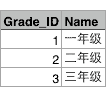
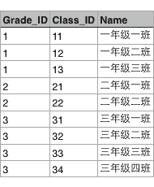
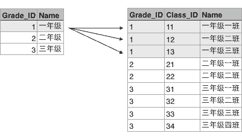
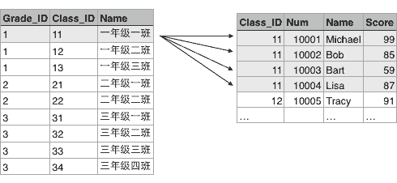

# Web开发

用Node.js开发Web服务器端，有几个显著的优势：

一是后端语言也是JavaScript，以前掌握了前端JavaScript的开发人员，现在可以同时编写后端代码；

二是前后端统一使用JavaScript，就没有切换语言的障碍了；

三是速度快，非常快！这得益于Node.js天生是异步的。

在Node.js诞生后的短短几年里，出现了无数种Web框架、ORM框架、模版引擎、测试框架、自动化构建工具，数量之多，即使是JavaScript老司机，也不免眼花缭乱。

常见的Web框架包括：[Express](http://expressjs.com/)，[Sails.js](http://sailsjs.org/)，[koa](http://koajs.com/)，[Meteor](https://www.meteor.com/)，[DerbyJS](http://derbyjs.com/)，[Total.js](https://www.totaljs.com/)，[restify](http://restify.com/)……

ORM框架比Web框架要少一些：[Sequelize](http://www.sequelizejs.com/)，[ORM2](http://dresende.github.io/node-orm2/)，[Bookshelf.js](http://bookshelfjs.org/)，[Objection.js](http://vincit.github.io/objection.js/)……

模版引擎PK：[Jade](http://jade-lang.com/)，[EJS](http://ejs.co/)，[Swig](https://github.com/paularmstrong/swig)，[Nunjucks](http://mozilla.github.io/nunjucks/)，[doT.js](http://olado.github.io/doT/)……

测试框架包括：[Mocha](http://mochajs.org/)，[Expresso](http://visionmedia.github.io/expresso/)，[Unit.js](http://unitjs.com/)，[Karma](http://karma-runner.github.io/)……

构建工具有：[Grunt](http://gruntjs.com/)，[Gulp](http://gulpjs.com/)，[Webpack](http://webpack.github.io/)……

目前，在npm上已发布的开源Node.js模块数量超过了30万个。

所有的第三方包都可以通过npm官网搜索并查看其文档：https://www.npmjs.com/

# koa

## koa的版本历史

koa的前身是Express，都是基于Node.js的web框架，有1.x和2.0两个版本。

Express对Node.js的http进行了封装，用起来如下：

```javascript
var express = require('express');
var app = express();

app.get('/', function (req, res) {
    res.send('Hello World!');
});

app.listen(3000, function () {
    console.log('Example app listening on port 3000!');
});
```

Express的API是基于ES5的语法回调函数实现的异步代码，如果异步嵌套层次过多，代码写起来就非常难看：

```javascript
app.get('/test', function (req, res) {
    fs.readFile('/file1', function (err, data) {
        if (err) {
            res.status(500).send('read file1 error');
        }
        fs.readFile('/file2', function (err, data) {
            if (err) {
                res.status(500).send('read file2 error');
            }
            res.type('text/plain');
            res.send(data);
        });
    });
});
```

后来，Express的团队基于ES6的generator重新编写了web框架koa，使用generator实现异步：

```javascript
var koa = require('koa');
var app = koa();

app.use('/test', function *() {
    yield doReadFile1();
    var data = yield doReadFile2();
    this.body = data;
});

app.listen(3000);
```

为了简化异步代码，ES7引入了新的关键字`async`和`await`，可以轻松地把一个function变为异步模式：

```javascript
async function () {
    var data = await fs.read('/file1');
}
```

这是JavaScript未来标准的异步代码，非常简洁，并且易于使用。

后面koa团队基于ES7开发了koa2，它完全使用Promise并配合`async`来实现异步。

koa2的代码看上去像这样：

```javascript
app.use(async (ctx, next) => {
    await next();
    var data = await doReadFile();
    ctx.response.type = 'text/plain';
    ctx.response.body = data;
});
```

## koa入门

### 创建koa2工程

创建`app.js`，输入以下代码：

```javascript
// 在koa2中，导入的是一个class，因此用大写的Koa表示:
const Koa = require('koa');

// 创建一个Koa对象表示web app本身:
const app = new Koa();

// 对于任何请求，app将调用该异步函数处理请求：
app.use(async (ctx, next) => {
    await next();
    ctx.response.type = 'text/html';
    ctx.response.body = '<h1>Hello, koa2!</h1>';
});

// 在端口3000监听:
app.listen(3000);
console.log('app started at port 3000...');
```

对于每一个http请求，koa将调用传入的异步函数`async (ctx, next) =>{...}`来处理。

其中，参数`ctx`封装了request和response的变量，`next`是koa传入的将要处理的下一个异步函数。

上面的异步函数中，首先用`await next();`处理下一个异步函数，然后，设置response的Content-Type和内容。

### 安装koa包

如果直接运行上面的程序，可能会报`Error: Cannot find module 'koa'`。

表示需要安装koa包才可以导入。

在`app.js`同级目录运行npm命令：

```
...\koa\test>npm install koa@2.11.0
npm WARN nodejsdemo@1.0.0 No description
npm WARN nodejsdemo@1.0.0 No repository field.

+ koa@2.11.0
added 43 packages from 23 contributors in 5.114s
```

npm会把koa2以及koa2依赖的所有包全部安装到当前目录的node_modules目录下。

### 依赖包配置文件

在项目目录下创建一个`package.json`，用于描述这个项目会用到哪些包。完整的文件内容如下：

```json
{
  "name": "hello-koa",
  "version": "1.0.0",
  "description": "Hello Koa 2 example with async",
  "main": "app.js",
  "scripts": {
    "start": "node --use_strict app.js"
  },
  "keywords": [
    "koa",
    "async"
  ],
  "author": "xiaoxiaoming",
  "license": "Apache-2.0",
  "repository": {
    "type": "git",
    "url": "https://github.com/xiao-xiaoming"
  },
  "dependencies": {
    "koa": "2.11.0"
  }
}
```

其中，`dependencies`描述工程依赖的包以及版本号。其他字段均用来描述项目信息，可任意填写。

然后在`hello-koa`目录下执行`npm install`就可以把所需包以及依赖包一次性全部装好：

```
D:\...\hello-koa> npm install
added 43 packages from 23 contributors in 1.623s
```

只要在`package.json`正确设置了依赖，npm就会把所有用到的包都装好。任何时候都可以直接删除整个`node_modules`目录，因为用`npm install`命令可以完整地重新下载所有依赖。

工程结构如下：

```
hello-koa/
|
+- app.js <-- 使用koa的js
|
+- package.json <-- 项目描述文件
|
+- node_modules/ <-- npm安装的所有依赖包
```

除了通过命令`node app.js`启动程序外，还可以用`npm start`启动定义在`package.json`文件中的start对应命令：

```javascript
D:\...\hello-koa> npm start

> hello-koa@1.0.0 start D:\...\hello-koa
> node --use_strict app.js

app started at port 3000...
```

### koa middleware

koa的执行逻辑，核心代码是：

```javascript
app.use(async (ctx, next) => {
    await next();
    ctx.response.type = 'text/html';
    ctx.response.body = '<h1>Hello, koa2!</h1>';
});
```

每收到一个http请求，koa就会调用通过`app.use()`注册的async函数，并传入`ctx`和`next`参数。

koa通过`await next()`把很多async函数组成一个处理链，用来调用下一个async函数。每个async函数称为middleware。

可以用以下3个middleware组成处理链，依次打印日志，记录处理时间，输出HTML：

```javascript
app.use(async (ctx, next) => {
    console.log(`${ctx.request.method} ${ctx.request.url}`); // 打印URL
    await next(); // 调用下一个middleware
});

app.use(async (ctx, next) => {
    const start = new Date().getTime(); // 当前时间
    await next(); // 调用下一个middleware
    const ms = new Date().getTime() - start; // 耗费时间
    console.log(`Time: ${ms}ms`); // 打印耗费时间
});

app.use(async (ctx, next) => {
    await next();
    ctx.response.type = 'text/html';
    ctx.response.body = '<h1>Hello, koa2!</h1>';
});
```

调用`app.use()`的顺序决定了middleware的顺序。

如果一个middleware没有调用`await next()`，后续的middleware将不再执行了。这种情况也很常见，例如，一个检测用户权限的middleware可以决定是否继续处理请求，还是直接返回403错误：

```javascript
app.use(async (ctx, next) => {
    if (await checkUserPermission(ctx)) {
        await next();
    } else {
        ctx.response.status = 403;
    }
});
```

`ctx`对象有一些简写的方法，例如`ctx.url`相当于`ctx.request.url`，`ctx.type`相当于`ctx.response.type`。

### 处理URL

为了处理URL，需要引入`koa-router`这个middleware，让它负责处理URL映射。

`koa-router`在`package.json`中添加的依赖项：

```
"koa-router": "7.0.0"
```

使用`koa-router`来处理URL：

```javascript
const Koa = require('koa');

// require('koa-router')返回的是函数:
const router = require('koa-router')();

const app = new Koa();

// log request URL:
app.use(async (ctx, next) => {
    console.log(`Process ${ctx.request.method} ${ctx.request.url}...`);
    await next();
});

// add url-route:
router.get('/hello/:name', async (ctx, next) => {
    var name = ctx.params.name;
    ctx.response.body = `<h1>Hello, ${name}!</h1>`;
});

router.get('/', async (ctx, next) => {
    ctx.response.body = '<h1>Index</h1>';
});

// add router middleware:
app.use(router.routes());

app.listen(3000);
console.log('app started at port 3000...');
```

使用`router.get('/path', async fn)`来注册一个GET请求。可以在请求路径中使用带变量的`/hello/:name`，变量可以通过`ctx.params.name`访问。

用`router.get('/path', async fn)`处理的是get请求。如果要处理post请求，可以用`router.post('/path', async fn)`。

用post请求处理URL时，我们会遇到一个问题：post请求通常会发送一个表单，或者JSON，它作为request的body发送，但无论是Node.js提供的原始request对象，还是koa提供的request对象，都*不提供*解析request的body的功能！

post请求通常会将发送的数据绑定到request的body中，而`koa-bodyparser`这个middleware则具有解析request的body的功能，可以把解析后的参数，绑定到`ctx.request.body`中。

`koa-bodyparser`在`package.json`中的依赖项：

```json
"koa-bodyparser": "3.2.0"
```

引入`koa-bodyparser`：

```javascript
const bodyParser = require('koa-bodyparser');
app.use(bodyParser());
```

由于middleware的顺序很重要，`koa-bodyparser`必须在`router`之前被注册到`app`对象上。

一个简单的登录表单，处理post请求：

```javascript
router.get('/', async (ctx, next) => {
    ctx.response.body = `<h1>Index</h1>
        <form action="/signin" method="post">
            <p>Name: <input name="name" value="koa"></p>
            <p>Password: <input name="password" type="password"></p>
            <p><input type="submit" value="Submit"></p>
        </form>`;
});

router.post('/signin', async (ctx, next) => {
    var
        name = ctx.request.body.name || '',
        password = ctx.request.body.password || '';
    console.log(`signin with name: ${name}, password: ${password}`);
    if (name === 'koa' && password === '12345') {
        ctx.response.body = `<h1>Welcome, ${name}!</h1>`;
    } else {
        ctx.response.body = `<h1>Login failed!</h1>
        <p><a href="/">Try again</a></p>`;
    }
});
```

put、delete、head请求也可以由router处理。

### 重构

如果所有的URL处理函数都放到`app.js`里显得很乱，而且，每加一个URL，就需要修改`app.js`。随着URL越来越多，`app.js`就会越来越长。

如果能把URL处理函数集中到某个js文件，或者某几个js文件中就好了，然后让`app.js`自动导入所有处理URL的函数。比如：

```
url2-koa/
|
+- controllers/
|  |
|  +- login.js <-- 处理login相关URL
|  |
|  +- users.js <-- 处理用户管理相关URL
|
+- app.js <-- 使用koa的js
|
+- package.json <-- 项目描述文件
|
+- node_modules/ <-- npm安装的所有依赖包
```

先在`controllers`目录下编写`index.js`：

```javascript
var fn_index = async (ctx, next) => {
    ctx.response.body = `<h1>Index</h1>
        <form action="/signin" method="post">
            <p>Name: <input name="name" value="koa"></p>
            <p>Password: <input name="password" type="password"></p>
            <p><input type="submit" value="Submit"></p>
        </form>`;
};

var fn_signin = async (ctx, next) => {
    var
        name = ctx.request.body.name || '',
        password = ctx.request.body.password || '';
    console.log(`signin with name: ${name}, password: ${password}`);
    if (name === 'koa' && password === '12345') {
        ctx.response.body = `<h1>Welcome, ${name}!</h1>`;
    } else {
        ctx.response.body = `<h1>Login failed!</h1>
        <p><a href="/">Try again</a></p>`;
    }
};

module.exports = {
    'GET /': fn_index,
    'POST /signin': fn_signin
};
```

这个`index.js`通过`module.exports`把两个URL处理函数暴露出来。

类似的，`hello.js`把一个URL处理函数暴露出来：

```javascript
var fn_hello = async (ctx, next) => {
    var name = ctx.params.name;
    ctx.response.body = `<h1>Hello, ${name}!</h1>`;
};

module.exports = {
    'GET /hello/:name': fn_hello
};
```

### Controller Middleware

让`app.js`可以自动扫描`controllers`目录，找到所有`js`文件导入，然后注册每个URL。这个功能可以抽取成一个简单的middleware使用，命名为`controller.js`：

```javascript
const fs = require('fs');

// add url-route in /controllers:
function addMapping(router, mapping) {
    let reg = /^(\w+) (\S+)$/;
    for (var url in mapping) {
        try {
            let [_, method, path] = reg.exec(url);
            router[method.toLowerCase()](path, mapping[url]);
            console.log(`register URL mapping: ${url}`);
        } catch (e) {
            console.log(e);
        }
    }
}

function addControllers(router, dir) {
    fs.readdirSync('./' + dir).filter((f) => {
        return f.endsWith('.js');
    }).forEach((f) => {
        console.log(`process controller: ${f}...`);
        let mapping = require('./' + dir + '/' + f);
        addMapping(router, mapping);
    });
}

module.exports = function (dir) {
    let
        controllers_dir = dir || 'controllers',
        router = require('koa-router')();
    addControllers(router, controllers_dir);
    return router.routes();
};
```

使用controller middleware:

```javascript
const Koa = require('koa');
const bodyParser = require('koa-bodyparser');
const controller = require('./controller');

const app = new Koa();
// parse request body:
app.use(bodyParser());
// add controllers:
app.use(controller());
app.listen(3000);
console.log('app started at port 3000...');
```

以后所有处理URL的函数按功能组存放在`controllers`目录。

# 模板引擎Nunjucks

Nunjucks是一个模板引擎。模板引擎就是基于模板配合数据构造出字符串输出的一个组件。

Nunjucks是Mozilla开发的一个纯JavaScript编写的模板引擎，既可以用在Node环境下，又可以运行在浏览器端。但是，主要还是运行在Node环境下，因为浏览器端有更好的模板解决方案，例如MVVM框架。

Nunjucks是用JavaScript重新实现了jinjia2，所以Nunjucks的语法跟Python的模板引擎jinja2几乎是一模一样的。

虽然模板引擎内部可能非常复杂，但使用一个模板引擎只需要构造这样一个函数：

```javascript
function render(view, model) {
    // TODO:...
}
```

其中，`view`是模板的名称（又称为视图），因为可能存在多个模板，需要选择其中一个。`model`就是数据，在JavaScript中，它就是一个简单的Object。`render`函数返回一个字符串，就是模板的输出。

下面使用Nunjucks这个模板引擎来编写几个HTML模板，并且用实际数据来渲染模板并获得最终的HTML输出。

创建一个`use-nunjucks`的工程结构如下：

```
use-nunjucks/
|
+- views/
|  |
|  +- hello.html <-- HTML模板文件
|
+- app.js <-- 入口js
|
+- package.json <-- 项目描述文件
|
+- node_modules/ <-- npm安装的所有依赖包
```

其中，模板文件存放在`views`目录中。

在`package.json`中的依赖：

```
"nunjucks": "2.4.2"
```

模板引擎可以独立使用并不依赖koa。

## 基本使用

```javascript
const nunjucks = require('nunjucks');

function createEnv(path, opts) {
    var
        autoescape = opts.autoescape === undefined ? true : opts.autoescape,
        noCache = opts.noCache || false,
        watch = opts.watch || false,
        throwOnUndefined = opts.throwOnUndefined || false,
        env = new nunjucks.Environment(
            new nunjucks.FileSystemLoader('views', {
                noCache: noCache,
                watch: watch,
            }), {
                autoescape: autoescape,
                throwOnUndefined: throwOnUndefined
            });
    if (opts.filters) {
        for (var f in opts.filters) {
            env.addFilter(f, opts.filters[f]);
        }
    }
    return env;
}

var env = createEnv('views', {
    watch: true,
    filters: {
        hex: function (n) {
            return '0x' + n.toString(16);
        }
    }
});
```

变量`env`就表示Nunjucks模板引擎对象，它有一个`render(view, model)`方法，正好传入`view`和`model`两个参数，并返回字符串。

编写一个`hello.html`模板文件，放到`views`目录下，内容如下：

```html
<h1>Hello {{ name }}</h1>
```

然后，就可以用下面的代码来渲染这个模板：

```javascript
var s = env.render('hello.html', { name: '<script>alert("小明")</script>' });
console.log(s);
```

获得输出如下：

```html
<h1>Hello &lt;script&gt;alert("小明")&lt;/script&gt;</h1>
```

能够自动对一些脚本进行转义。

此外，可以使用Nunjucks提供的功能强大的tag，编写条件判断、循环等功能，例如：

```html
<!-- 循环输出名字 -->
<body>
    <h3>Fruits List</h3>
    
    <p>{{ f }}</p>
    
</body>
```

## Nunjucks模板的继承

先定义一个基本的网页框架`base.html`：

```html
<html><body>
 <h3>Unnamed</h3> 
 <div>No body</div> 
 <div>copyright</div> 
</body>
```

`base.html`定义了三个可编辑的块，分别命名为`header`、`body`和`footer`。子模板可以有选择地对块进行重新定义：

```


<h1>{{ header }}</h1>

<p>{{ body }}</p>
```

然后对子模板进行渲染：

```javascript
console.log(env.render('extend.html', {
    header: 'Hello',
    body: 'bla bla bla...'
}));
```

输出HTML如下：

```html
<html>
<body>
<h1>Hello</h1>
<p>bla bla bla...</p>
<div>copyright</div> <-- footer没有重定义，所以仍使用父模板的内容
</body>
```

## 性能问题

Nunjucks默认使用同步IO读取模板文件，所以在这一步性能会收到影响。不过只要指定了`noCache: false`这个参数Nunjucks就会缓存已读取的文件内容，模板文件最多读取一次，就会放在内存中。

在开发环境下，可以关闭cache，这样每次重新加载模板，便于实时修改模板。在生产环境下，一定要打开cache，这样就不会有性能问题。

虽然Nunjucks也提供了异步读取的方式，但是写起来很麻烦，保持代码简单是可维护性的关键。

# MVC

当用户通过浏览器请求一个URL时，koa将调用某个异步函数处理该URL。在这个异步函数内部，用一行代码：

```
ctx.render('home.html', { name: 'Michael' });
```

通过Nunjucks把数据用指定的模板渲染成HTML，然后输出给浏览器，用户就可以看到渲染后的页面了：


MVC全称Model-View-Controller，中文名“模型-视图-控制器”。

异步函数是C：Controller，Controller负责业务逻辑，比如检查用户名是否存在，取出用户信息等等；

变量`{{ name }}`的模板就是V：View，View负责显示逻辑，通过简单地替换一些变量，View最终输出的就是用户看到的HTML。

Model是用来传给View的，View在替换变量的时候可以从Model中取出相应的数据。

Model是一个JavaScript对象：

```json
{ name: 'Michael' }
```

下面创建工程`view-koa`，把koa、Nunjucks整合起来，实现MVC架构。

工程`view-koa`结构如下：

```
view-koa/
|
+- controllers/ <-- Controller
|
+- views/ <-- html模板文件
|
+- static/ <-- 静态资源文件
|
+- controller.js <-- 扫描注册Controller
|
+- app.js <-- 使用koa的js
|
+- package.json <-- 项目描述文件
|
+- node_modules/ <-- npm安装的所有依赖包
```

在`package.json`中，将要用到的依赖包有：

```
"koa": "2.11.0",
"koa-bodyparser": "3.2.0",
"koa-router": "7.0.0",
"nunjucks": "2.4.2",
"mime": "1.3.4",
"mz": "2.4.0"
```

先用`npm install`安装依赖包。

## 编写Controller

koa并没有在`ctx`对象上提供`render`方法，这里先假设已经添加了这个方法。

定义一个async函数处理首页URL`/`：

```javascript
async (ctx, next) => {
    ctx.render('index.html', {
        title: 'Welcome'
    });
}
```

处理登录请求POST /signin：

```javascript
async (ctx, next) => {
    var
        email = ctx.request.body.email || '',
        password = ctx.request.body.password || '';
    if (email === 'admin@example.com' && password === '123456') {
        // 登录成功:
        ctx.render('signin-ok.html', {
            title: 'Sign In OK',
            name: 'Mr Node'
        });
    } else {
        // 登录失败:
        ctx.render('signin-failed.html', {
            title: 'Sign In Failed'
        });
    }
}
```

登录成功时用`signin-ok.html`渲染，登录失败时用`signin-failed.html`渲染，一共需要以下3个View：

- index.html
- signin-ok.html
- signin-failed.html

## 编写View

在编写View的时候，实际上是在编写HTML页。为了让页面看起来美观大方，这里使用[Bootstrap](http://getbootstrap.com/)这个CSS框架。从首页下载zip包后解压，然后把所有静态资源文件放到`/static`目录下：

```
view-koa/
|
+- static/
   |
   +- css/ <- 存放bootstrap.css等
   |
   +- fonts/ <- 存放字体文件
   |
   +- js/ <- 存放bootstrap.js等   
```

这样在编写HTML的时候，可以直接用Bootstrap的CSS，像这样：

```html
<link rel="stylesheet" href="/static/css/bootstrap.css">
```

在koa中，编写一个middleware处理以`/static/`开头的URL，即可统一处理所有的静态文件。

## 编写middleware

创建`static-files.js`文件，编写一个能处理静态文件的middleware：

```javascript
const path = require('path');
const mime = require('mime');
const fs = require('mz/fs');

// url: 类似 '/static/'
// dir: 类似 __dirname + '/static'
function staticFiles(url, dir) {
    return async (ctx, next) => {
        let rpath = ctx.request.path;
        // 判断是否以指定的url开头:
        if (rpath.startsWith(url)) {
            // 获取文件完整路径:
            let fp = path.join(dir, rpath.substring(url.length));
            // 判断文件是否存在:
            if (await fs.exists(fp)) {
                // 查找文件的mime:
                ctx.response.type = mime.lookup(rpath);
                // 读取文件内容并赋值给response.body:
                ctx.response.body = await fs.readFile(fp);
            } else {
                // 文件不存在:
                ctx.response.status = 404;
            }
        } else {
            // 不是指定前缀的URL，继续处理下一个middleware:
            await next();
        }
    };
}

module.exports = staticFiles;
```

`staticFiles`接收两个参数：URL前缀和一个目录，然后返回一个async函数。这个async函数会将指定前缀开头的URL视为文件，并发送文件内容。否则调用`await next()`让下一个middleware去处理请求。

上面通过`require('mz/fs');`导入了一个`mz`的包，`mz`提供的API和Node.js的`fs`模块完全相同，但`fs`模块使用回调，而`mz`封装了`fs`对应的函数，并改为Promise。这样，就可以非常简单的用`await`调用`mz`的函数，而不需要任何回调。

`mime`库用于根据文件名查找对应文件的mime类型，方便设置游览器响应。

最后，这个middleware使用起来也很简单，在`app.js`里加一行代码：

```javascript
let staticFiles = require('./static-files');
app.use(staticFiles('/static/', __dirname + './static'));
```

也可以去npm搜索能用于koa2的处理静态文件的包并直接使用。

## 集成Nunjucks

编写一个middleware，给`ctx`对象绑定一个`render(view, model)`的方法。

创建一个`templating.js`来实现这个middleware：

```javascript
const nunjucks = require('nunjucks');

function createEnv(path, opts) {
    var
        autoescape = opts.autoescape === undefined ? true : opts.autoescape,
        noCache = opts.noCache || false,
        watch = opts.watch || false,
        throwOnUndefined = opts.throwOnUndefined || false,
        env = new nunjucks.Environment(
            new nunjucks.FileSystemLoader(path || 'views', {
                noCache: noCache,
                watch: watch,
            }), {
                autoescape: autoescape,
                throwOnUndefined: throwOnUndefined
            });
    if (opts.filters) {
        for (var f in opts.filters) {
            env.addFilter(f, opts.filters[f]);
        }
    }
    return env;
}

function templating(path, opts) {
    // 创建Nunjucks的env对象:
    var env = createEnv(path, opts);
    return async (ctx, next) => {
        // 给ctx绑定render函数:
        ctx.render = function (view, model) {
            // 把render后的内容赋值给response.body:
            ctx.response.body = env.render(view, Object.assign({}, ctx.state || {}, model || {}));
            // 设置Content-Type:
            ctx.response.type = 'text/html';
        };
        // 继续处理请求:
        await next();
    };
}
module.exports = templating;
```

`tempating()`函数会返回一个middleware，它给`ctx`绑定`render()`函数之后就继续调用下一个middleware。

使用的时候在`app.js`添加如下代码：

```javascript
const isProduction = process.env.NODE_ENV === 'production';

app.use(templating('views', {
    noCache: !isProduction,
    watch: !isProduction
}));
```

常量`isProduction`判断当前环境是否是production环境。如果是，就使用缓存，如果不是，就关闭缓存。在开发环境下，关闭缓存后修改View，可以直接刷新浏览器看到效果，否则，每次修改都必须重启Node程序，会极大地降低开发效率。

Node.js在全局变量`process`中定义了一个环境变量`env.NODE_ENV`，在开发的时候，环境变量应该设置为`'development'`，而部署到服务器时，环境变量应该设置为`'production'`。

编写的处理静态文件的middleware时，也可以根据环境变量判断：

```javascript
if (! isProduction) {
    let staticFiles = require('./static-files');
    app.use(staticFiles('/static/', __dirname + '/static'));
}
```

这是因为在生产环境下，静态文件是由部署在最前面的反向代理服务器（如Nginx）处理的，Node程序不需要处理静态文件。而在开发环境下，需要koa能顺带处理静态文件进行测试。

## 运行

第一个middleware是记录URL以及页面执行时间：

```javascript
app.use(async (ctx, next) => {
    console.log(`Process ${ctx.request.method} ${ctx.request.url}...`);
    var
        start = new Date().getTime(),
        execTime;
    await next();
    execTime = new Date().getTime() - start;
    ctx.response.set('X-Response-Time', `${execTime}ms`);
});
```

第二个middleware处理静态文件：

```javascript
if (! isProduction) {
    let staticFiles = require('./static-files');
    app.use(staticFiles('/static/', __dirname + '/static'));
}
```

第三个middleware解析POST请求：

```javascript
app.use(bodyParser());
```

第四个middleware负责给`ctx`加上`render()`来使用Nunjucks：

```javascript
app.use(templating('view', {
    noCache: !isProduction,
    watch: !isProduction
}));
```

最后一个middleware处理URL路由：

```javascript
app.use(controller());
```

注意到`ctx.render`内部渲染模板时：

```javascript
Object.assign({}, ctx.state || {}, model || {})
```

`model || {}`确保了即使传入`undefined`，model也会变为默认值`{}`。`Object.assign()`会把除第一个参数外的其他参数的所有属性复制到第一个参数中。`ctx.state || {}`是为了能把一些公共的变量放入`ctx.state`并传给View。

例如，某个middleware负责检查用户权限，它可以把当前用户放入`ctx.state`中：

```javascript
app.use(async (ctx, next) => {
    var user = tryGetUserFromCookie(ctx.request);
    if (user) {
        ctx.state.user = user;
        await next();
    } else {
        ctx.response.status = 403;
    }
});
```

这样就没有必要在每个Controller的async函数中都把user变量放入model中。

# mysql

## 关系模型

数据库软件诞生的历史非常久远，早在1950年数据库就诞生了。经历了网状数据库，层次数据库，我们现在广泛使用的关系数据库是20世纪70年代基于关系模型的基础上诞生的。

关系模型示例：

假设某个XX省YY市ZZ县第一实验小学有3个年级，要表示出这3个年级，可以在Excel中用一个表格画出来：



每个年级又有若干个班级，要把所有班级表示出来，可以在Excel中再画一个表格：



这两个表格有个映射关系，就是根据Grade_ID可以在班级表中查找到对应的所有班级：



也就是Grade表的每一行对应Class表的多行，在关系数据库中，这种基于表（Table）的一对多的关系就是关系数据库的基础。

根据某个年级的ID就可以查找所有班级的行，这种查询语句在关系数据库中称为SQL语句，可以写成：

```sql
SELECT * FROM classes WHERE grade_id = '1';
```

结果也是一个表：

```sql
---------+----------+----------
grade_id | class_id | name
---------+----------+----------
1        | 11       | 一年级一班
---------+----------+----------
1        | 12       | 一年级二班
---------+----------+----------
1        | 13       | 一年级三班
---------+----------+----------
```

类似的，Class表的一行记录又可以关联到Student表的多行记录：



目前广泛使用的关系数据库有：

付费的商用数据库：

- Oracle，典型的高富帅；
- SQL Server，微软自家产品，Windows定制专款；
- DB2，IBM的产品，听起来挺高端；
- Sybase，曾经跟微软是好基友，后来关系破裂，现在家境惨淡。

免费的开源数据库：

- MySQL，大家都在用，一般错不了；
- PostgreSQL，学术气息有点重，其实挺不错，但知名度没有MySQL高；
- sqlite，嵌入式数据库，适合桌面和移动应用。

MySQL普及率最高，出了错，可以很容易找到解决方法。而且，围绕MySQL有一大堆监控和运维的工具，安装和使用很方便。所以选择MySQL作为关系型数据库。

## 安装MySQL

MySQL官网下载地址：[MySQL Community Server 5.6](http://dev.mysql.com/downloads/mysql/)

在Windows上，安装需选择`UTF-8`编码，以便正确地处理中文。

在Mac或Linux上，需要编辑MySQL的配置文件，把数据库默认的编码全部改为UTF-8。MySQL的配置文件默认存放在`/etc/my.cnf`或者`/etc/mysql/my.cnf`：

```ini
[client]
default-character-set = utf8

[mysqld]
default-storage-engine = INNODB
character-set-server = utf8
collation-server = utf8_general_ci
```

重启MySQL后，可以通过MySQL的客户端命令行检查编码：

```bash
$ mysql -u root -p
Enter password: 
Welcome to the MySQL monitor...
...

mysql> show variables like '%char%';
+--------------------------+--------------------------------------------------------+
| Variable_name            | Value                                                  |
+--------------------------+--------------------------------------------------------+
| character_set_client     | utf8                                                   |
| character_set_connection | utf8                                                   |
| character_set_database   | utf8                                                   |
| character_set_filesystem | binary                                                 |
| character_set_results    | utf8                                                   |
| character_set_server     | utf8                                                   |
| character_set_system     | utf8                                                   |
| character_sets_dir       | /usr/local/mysql-5.1.65-osx10.6-x86_64/share/charsets/ |
+--------------------------+--------------------------------------------------------+
8 rows in set (0.00 sec)
```

看到`utf8`字样就表示编码设置正确。

*注*：如果MySQL的版本≥5.5.3，可以把编码设置为`utf8mb4`，`utf8mb4`和`utf8`完全兼容，但它支持最新的Unicode标准，可以显示emoji字符。

## 使用Sequelize

Sequelize的API可以参考[官方文档](http://docs.sequelizejs.com/)。

ORM技术：Object-Relational Mapping，把关系数据库的表结构映射到对象上。

如果直接使用`mysql`包提供的接口，编写的代码就比较底层，例如，查询代码：

```javascript
connection.query('SELECT * FROM users WHERE id = ?', ['123'], function(err, rows) {
    if (err) {
        // error
    } else {
        for (let row in rows) {
            processRow(row);
        }
    }
});
```

考虑到数据库表是一个二维表，包含多行多列，例如一个`pets`的表：

```sql
mysql> select * from pets;
+----+--------+------------+
| id | name   | birth      |
+----+--------+------------+
|  1 | Gaffey | 2007-07-07 |
|  2 | Odie   | 2008-08-08 |
+----+--------+------------+
2 rows in set (0.00 sec)
```

每一行可以用一个JavaScript对象表示，例如第一行：

```json
{
    "id": 1,
    "name": "Gaffey",
    "birth": "2007-07-07"
}
```

而Node的ORM框架Sequelize可以把对象变成数据库中的行，读写的都是JavaScript对象。

用Sequelize查询`pets`表，代码像这样：

```javascript
Pet.findAll()
   .then(function (pets) {
       for (let pet in pets) {
           console.log(`${pet.id}: ${pet.name}`);
       }
   }).catch(function (err) {
       // error
   });
```

因为Sequelize返回的对象是Promise，所以可以用`then()`和`catch()`分别异步响应成功和失败。

也可以用ES7的await来调用任何一个Promise对象，这样写出来的代码就变成了：

```javascript
var pets = await Pet.findAll();
```

await只有一个限制，就是必须在async函数中调用。上面的代码直接运行还差一点，可以改成：

```javascript
(async () => {
    var pets = await Pet.findAll();
})();
```

await可以调用Promise对象，而Sequelize的API可以返回Promise对象，所以选择了Sequelize来操作数据库。

**测试：**

初始化sql脚本：

```sql
grant all privileges on test.* to 'www'@'%' identified by 'www';

use test;

create table pets (
    id varchar(50) not null,
    name varchar(100) not null,
    gender bool not null,
    birth varchar(10) not null,
    createdAt bigint not null,
    updatedAt bigint not null,
    version bigint not null,
    primary key (id)
) engine=innodb;
```

`hello-sequelize`工程结构：

```
hello-sequelize/
|
+- init.txt <-- 初始化SQL命令
|
+- config.js <-- MySQL配置文件
|
+- app.js <-- 使用koa的js
|
+- package.json <-- 项目描述文件
|
+- node_modules/ <-- npm安装的所有依赖包
```

`packsge.json`中添加的依赖包：

```json
"sequelize": "3.24.1",
"mysql": "2.11.1"
```

`config.js`是一个简单的配置文件：

```javascript
var config = {
    database: 'test', // 使用哪个数据库
    username: 'www', // 用户名
    password: 'www', // 口令
    host: 'localhost', // 主机名
    port: 3306 // 端口号，MySQL默认3306
};

module.exports = config;
```

创建sequelize对象实例：

```javascript
const Sequelize = require('sequelize');
const config = require('./config');

var sequelize = new Sequelize(config.database, config.username, config.password, {
    host: config.host,
    dialect: 'mysql',
    pool: {
        max: 5,
        min: 0,
        idle: 30000
    }
});
```

定义模型Pet，告诉Sequelize如何映射数据库表：

```javascript
var Pet = sequelize.define('pet', {
    id: {
        type: Sequelize.STRING(50),
        primaryKey: true
    },
    name: Sequelize.STRING(100),
    gender: Sequelize.BOOLEAN,
    birth: Sequelize.STRING(10),
    createdAt: Sequelize.BIGINT,
    updatedAt: Sequelize.BIGINT,
    version: Sequelize.BIGINT
}, {
    timestamps: false
});
```

用`sequelize.define()`定义Model时，传入名称`pet`，默认的表名是`pets`。

第二个参数指定列名和数据类型，如果是主键，需要更详细地指定。

第三个参数是额外的配置，传入`{ timestamps: false }`是为了关闭Sequelize的自动添加timestamp的功能。

向数据库写数据，用Promise的方式写：

```javascript
var now = Date.now();

Pet.create({
    id: 'g-' + now,
    name: 'Gaffey',
    gender: false,
    birth: '2007-07-07',
    createdAt: now,
    updatedAt: now,
    version: 0
}).then(function (p) {
    console.log('created.' + JSON.stringify(p));
}).catch(function (err) {
    console.log('failed: ' + err);
});
```

用await方式写：

```javascript
(async () => {
    var dog = await Pet.create({
        id: 'd-' + now,
        name: 'Odie',
        gender: false,
        birth: '2008-08-08',
        createdAt: now,
        updatedAt: now,
        version: 0
    });
    console.log('created: ' + JSON.stringify(dog));
})();
```

查询数据时await写法如下：

```javascript
(async () => {
    var pets = await Pet.findAll({
        where: {
            name: 'Gaffey'
        }
    });
    console.log(`find ${pets.length} pets:`);
    for (let p of pets) {
        console.log(JSON.stringify(p));
    }
})();
```

更新数据可以对查询到的实例调用`save()`方法：

```javascript
(async () => {
    var p = await queryFromSomewhere();
    p.gender = true;
    p.updatedAt = Date.now();
    p.version ++;
    await p.save();
})();
```

删除数据可以对查询到的实例调用`destroy()`方法：

```javascript
(async () => {
    var p = await queryFromSomewhere();
    await p.destroy();
})();
```

运行代码，Sequelize会打印出的每一个SQL语句，便于查看：

```sql
Executing (default): INSERT INTO `pets` (`id`,`name`,`gender`,`birth`,`createdAt`,`updatedAt`,`version`) VALUES ('g-1471961204219','Gaffey',false,'2007-07-07',1471961204219,1471961204219,0);
```

## Model

通过`sequelize.define()`返回的`Pet`称为Model，它表示一个数据模型。

`Pet.findAll()`方法可以接收`where`、`order`这些参数，这和将要生成的SQL语句是对应的。返回了一组Model实例，每个实例的`save()`和`destroy()`方法可以执行更新或者删除操作。

自动加timestamp：

```javascript
var Pet = sequelize.define('pet', {
    id: {
        type: Sequelize.STRING(50),
        primaryKey: true
    },
    name: Sequelize.STRING(100),
    createdAt: Sequelize.BIGINT,
    updatedAt: Sequelize.BIGINT
}, {
    timestamps: false
});
```

自增主键并且自定义表名：

```javascript
var Pet = sequelize.define('pet', {
    id: {
        type: Sequelize.INTEGER,
        autoIncrement: true,
        primaryKey: true
    },
    name: Sequelize.STRING(100)
}, {
    tableName: 't_pet'
});
```

一个大型Web App通常都有几十个映射表，一个映射表就是一个Model。需要一个统一的模型，强迫所有Model都遵守同一个规范，这样不但实现简单，而且容易统一风格。

## Model编写规范

首先要定义的Model存放的文件夹必须在`models`内，并且以Model名字命名，例如：`Pet.js`，`User.js`等等。

其次，每个Model必须遵守一套规范：

1. 统一主键，名称必须是`id`，类型必须是`STRING(50)`；
2. 主键可以自己指定，也可以由框架自动生成（如果为null或undefined）；
3. 所有字段默认为`NOT NULL`，除非显式指定；
4. 统一timestamp机制，每个Model必须有`createdAt`、`updatedAt`和`version`，分别记录创建时间、修改时间和版本号。其中，`createdAt`和`updatedAt`以`BIGINT`存储时间戳，最大的好处是无需处理时区，排序方便。`version`每次修改时自增。

不要直接使用Sequelize的API，而是通过`db.js`间接地定义Model。例如，`User.js`应该定义如下：

```javascript
const db = require('../db');

module.exports = db.defineModel('users', {
    email: {
        type: db.STRING(100),
        unique: true
    },
    passwd: db.STRING(100),
    name: db.STRING(100),
    gender: db.BOOLEAN
});
```

这样，User就具有`email`、`passwd`、`name`和`gender`这4个业务字段。`id`、`createdAt`、`updatedAt`和`version`应该自动加上，而不是每个Model都去重复定义。

所以，`db.js`的作用就是统一Model的定义：

```javascript
const Sequelize = require('sequelize');

console.log('init sequelize...');

var sequelize = new Sequelize('dbname', 'username', 'password', {
    host: 'localhost',
    dialect: 'mysql',
    pool: {
        max: 5,
        min: 0,
        idle: 10000
    }
});

const ID_TYPE = Sequelize.STRING(50);

function defineModel(name, attributes) {
    var attrs = {};
    for (let key in attributes) {
        let value = attributes[key];
        if (typeof value === 'object' && value['type']) {
            value.allowNull = value.allowNull || false;
            attrs[key] = value;
        } else {
            attrs[key] = {
                type: value,
                allowNull: false
            };
        }
    }
    attrs.id = {
        type: ID_TYPE,
        primaryKey: true
    };
    attrs.createdAt = {
        type: Sequelize.BIGINT,
        allowNull: false
    };
    attrs.updatedAt = {
        type: Sequelize.BIGINT,
        allowNull: false
    };
    attrs.version = {
        type: Sequelize.BIGINT,
        allowNull: false
    };
    return sequelize.define(name, attrs, {
        tableName: name,
        timestamps: false,
        hooks: {
            beforeValidate: function (obj) {
                let now = Date.now();
                if (obj.isNewRecord) {
                    if (!obj.id) {
                        obj.id = generateId();
                    }
                    obj.createdAt = now;
                    obj.updatedAt = now;
                    obj.version = 0;
                } else {
                    obj.updatedAt = Date.now();
                    obj.version++;
                }
            }
        }
    });
}
```

上面定义的`defineModel`就是为了强制实现上述规则。

在创建、修改Entity时会调用`defineModel`的函数，这些函数通过`hooks`在定义Model时设定。在`beforeValidate`这个事件中根据是否是`isNewRecord`设置主键（如果主键为`null`或`undefined`）、设置时间戳和版本号。

这么一来，Model定义的时候就可以大大简化。

## 数据库配置

把简单的`config.js`拆成3个配置文件：

- config-default.js：存储默认的配置；
- config-override.js：存储特定的配置；
- config-test.js：存储用于测试的配置。

例如，默认的`config-default.js`可以配置如下：

```javascript
var config = {
    dialect: 'mysql',
    database: 'nodejs',
    username: 'www',
    password: 'www',
    host: 'localhost',
    port: 3306
};

module.exports = config;
```

而`config-override.js`可应用实际配置：

```javascript
var config = {
    database: 'production',
    username: 'www',
    password: 'secret-password',
    host: '192.168.1.199'
};

module.exports = config;
```

`config-test.js`可应用测试环境的配置：

```javascript
var config = {
    database: 'test'
};

module.exports = config;
```

读取配置的时候，用`config.js`实现不同环境读取不同的配置文件：

```javascript
const defaultConfig = './config-default.js';
// 可设定为绝对路径，如 /opt/product/config-override.js
const overrideConfig = './config-override.js';
const testConfig = './config-test.js';

const fs = require('fs');

var config = null;

if (process.env.NODE_ENV === 'test') {
    console.log(`Load ${testConfig}...`);
    config = require(testConfig);
} else {
    console.log(`Load ${defaultConfig}...`);
    config = require(defaultConfig);
    try {
        if (fs.statSync(overrideConfig).isFile()) {
            console.log(`Load ${overrideConfig}...`);
            config = Object.assign(config, require(overrideConfig));
        }
    } catch (err) {
        console.log(`Cannot load ${overrideConfig}.`);
    }
}

module.exports = config;
```

具体的规则是：

1. 如果是测试环境，就只读取`config-test.js`。
2. 如果不是测试环境，就先读取`config-default.js`；再读取`config-override.js`进行覆盖，文件不存在就忽略。

这样做测试环境下，本地和CI服务器统一使用`config-test.js`，测试数据库可以反复清空，不会影响开发。

## 使用Model

要使用Model，就需要引入对应的Model文件，编写`model.js`用于自动扫描并导入所有Model：

```javascript
const fs = require('fs');
const db = require('./db');

let files = fs.readdirSync(__dirname + '/models');

let js_files = files.filter((f)=>{
    return f.endsWith('.js');
}, files);

module.exports = {};

for (let f of js_files) {
    console.log(`import model from file ${f}...`);
    let name = f.substring(0, f.length - 3);
    module.exports[name] = require(__dirname + '/models/' + f);
}

module.exports.sync = () => {
    db.sync();
};
```

这样，使用的时候，写起来就像这样：

```javascript
const model = require('./model');

let
    Pet = model.Pet,
    User = model.User;

var pet = await Pet.create({ ... });
```

工程`model-sequelize`结构如下：

```
model-sequelize/
|
+- models/ <-- 存放所有Model
|  |
|  +- Pet.js <-- Pet
|  |
|  +- User.js <-- User
|
+- config.js <-- 配置文件入口
|
+- config-default.js <-- 默认配置文件
|
+- config-test.js <-- 测试配置文件
|
+- db.js <-- 如何定义Model
|
+- model.js <-- 如何导入Model
|
+- init-db.js <-- 初始化数据库
|
+- app.js <-- 业务代码
|
+- package.json <-- 项目描述文件
|
+- node_modules/ <-- npm安装的所有依赖包
```

Sequelize提供了一个`sync()`方法，可以自动创建数据库，这个功能在测试环境中非常有用。测试时，可以用`sync()`方法自动创建出表结构，而不是自己维护SQL脚本。这样，可以随时修改Model的定义，并立刻运行测试。开发环境下，首次使用`sync()`也可以自动创建出表结构，避免了手动运行SQL的问题。

`init-db.js`的代码：

```javascript
const model = require('./model.js');
model.sync();

console.log('init db ok.');
```

它避免了手动维护一个SQL脚本。

# mocha

## 测试驱动开发

“测试驱动开发”即（TDD：Test-Driven Development），单元测试是用来对一个模块、一个函数或者一个类来进行正确性检验的测试工作。

比如对函数abs()，可以编写出以下几个测试用例：

- 输入正数，比如1、1.2、0.99，期待返回值与输入相同；
- 输入负数，比如-1、-1.2、-0.99，期待返回值与输入相反；
- 输入0，期待返回0；
- 输入非数值类型，比如null、[]、{}，期待抛出Error。

把上面的测试用例放到一个测试模块里，就是一个完整的单元测试。

如果单元测试通过，说明我们测试的这个函数能够正常工作。如果单元测试不通过，要么函数有bug，要么测试条件输入不正确，总之，需要修复使单元测试能够通过。

这种以测试为驱动的开发模式最大的好处就是确保一个程序模块的行为符合我们设计的测试用例。在将来修改的时候，可以极大程度地保证该模块行为仍然是正确的。

## mocha简介

mocha是JavaScript的一种单元测试框架，既可以在浏览器环境下运行，也可以在Node.js环境下运行。

使用mocha只需要专注于编写单元测试本身，然后，让mocha去自动运行所有的测试，并给出测试结果。

mocha的特点主要有：

1. 既可以测试简单的JavaScript函数，又可以测试异步代码，因为异步是JavaScript的特性之一；
2. 可以自动运行所有测试，也可以只运行特定的测试；
3. 可以支持before、after、beforeEach和afterEach来编写初始化代码。

## 基本测试

假设编写了一个`hello.js`，并且输出一个简单的求和函数：

```javascript
// hello.js

module.exports = function (...rest) {
    var sum = 0;
    for (let n of rest) {
        sum += n;
    }
    return sum;
};
```

这个函数非常简单，就是对输入的任意参数求和并返回结果。

如果想对这个函数进行测试，可以写一个`test.js`，然后使用Node.js提供的`assert`模块进行断言：

```javascript
// test.js

const assert = require('assert');
const sum = require('./hello');

assert.strictEqual(sum(), 0);
assert.strictEqual(sum(1), 1);
assert.strictEqual(sum(1, 2), 3);
assert.strictEqual(sum(1, 2, 3), 6);
```

`assert`模块非常简单，它断言一个表达式为true。如果断言失败，就抛出Error。可以在Node.js文档中查看`assert`模块的[所有API](https://nodejs.org/dist/latest/docs/api/assert.html)。

单独写一个`test.js`的缺点是没法自动运行测试，而且，如果第一个assert报错，后面的测试也执行不了了。

如果有很多测试需要运行，就必须把这些测试全部组织起来，然后统一执行，并且得到执行结果。这就是我们为什么要用mocha来编写并运行测试。

### mocha test

创建`hello-test`工程来编写`hello.js`以及相关测试。工程结构如下：

```
hello-test/
|
+- hello.js <-- 待测试js文件
|
+- test/ <-- 存放所有test
｜ ｜
|  +- hello-test.js <-- 测试文件
|
+- package.json <-- 项目描述文件
|
+- node_modules/ <-- npm安装的所有依赖包
```

在`package.json`中添加mocha的依赖包。和其他依赖包不同，这次把依赖包添加到`"devDependencies"`中：

```json
{
  ...

  "dependencies": {},
  "devDependencies": {
    "mocha": "3.0.2"
  }
}
```

如果一个模块在运行的时候并不需要，仅仅在开发时才需要，就可以放到`devDependencies`中。这样，正式打包发布时，`devDependencies`的包不会被包含进来。

然后使用`npm install`安装即可。

*注意*，命令`npm install -g mocha`会把mocha安装到全局module中，但全局模块会影响到所有Node.js的工程。

在`test`目录下创建`hello-test.js`来编写测试，mocha默认会执行`test`目录下的所有测试，不要去改变默认目录。

`hello-test.js`内容如下：

```javascript
const assert = require('assert');
const sum = require('../hello');

describe('#hello.js', () => {

    describe('#sum()', () => {
        it('sum() should return 0', () => {
            assert.strictEqual(sum(), 0);
        });
        it('sum(1) should return 1', () => {
            assert.strictEqual(sum(1), 1);
        });
        it('sum(1, 2) should return 3', () => {
            assert.strictEqual(sum(1, 2), 3);
        });
        it('sum(1, 2, 3) should return 6', () => {
            assert.strictEqual(sum(1, 2, 3), 6);
        });
    });
});
```

这里使用mocha默认的BDD-style的测试。`describe`可以任意嵌套，以便把相关测试看成一组测试。

每个`it("name", function() {...})`就代表一个测试。例如，为了测试`sum(1, 2)`可这样写：

```javascript
it('sum(1, 2) should return 3', () => {
    assert.strictEqual(sum(1, 2), 3);
});
```

编写测试的原则是，一次只测一种情况，且测试代码要非常简单。编写多个测试来分别测试不同的输入，并使用`assert`判断输出是否是我们所期望的。

### 运行测试

在`hello-test`目录下执行命令：

```
C:\...\hello-test> node_modules\mocha\bin\mocha
```

mocha就会自动执行该目录下所有测试，然后输出如下：

```
  #hello.js
    #sum()
      ✓ sum() should return 0
      ✓ sum(1) should return 1
      ✓ sum(1, 2) should return 3
      ✓ sum(1, 2, 3) should return 6
  4 passing (7ms)
```

这说明编写的4个测试全部通过。如果没有通过，要么修改测试代码，要么修改`hello.js`，直到测试全部通过为止。

在`package.json`中可以添加npm命令：

```json
{
  ...
  "scripts": {
    "test": "mocha"
  },
  ...
}
```

然后在`hello-test`目录下执行命令：

```
C:\...\hello-test> npm test
```

可以得到和上面一样的输出。这种方式通过npm执行命令，输入的命令比较简单。

### before和after

在测试前初始化资源，测试后释放资源是非常常见的。mocha提供了before、after、beforeEach和afterEach来实现这些功能。

把`hello-test.js`改为：

```javascript
const assert = require('assert');
const sum = require('../hello');

describe('#hello.js', () => {
    describe('#sum()', () => {
        before(function () {
            console.log('before:');
        });

        after(function () {
            console.log('after.');
        });

        beforeEach(function () {
            console.log('  beforeEach:');
        });

        afterEach(function () {
            console.log('  afterEach.');
        });

        it('sum() should return 0', () => {
            assert.strictEqual(sum(), 0);
        });

        it('sum(1) should return 1', () => {
            assert.strictEqual(sum(1), 1);
        });

        it('sum(1, 2) should return 3', () => {
            assert.strictEqual(sum(1, 2), 3);
        });

        it('sum(1, 2, 3) should return 6', () => {
            assert.strictEqual(sum(1, 2, 3), 6);
        });
    });
});
```

再次运行，可以看到每个test执行前后会分别执行`beforeEach()`和`afterEach()`，以及一组test执行前后会分别执行`before()`和`after()`：

```
  #hello.js
    #sum()
before:
  beforeEach:
      ✓ sum() should return 0
  afterEach.
  beforeEach:
      ✓ sum(1) should return 1
  afterEach.
  beforeEach:
      ✓ sum(1, 2) should return 3
  afterEach.
  beforeEach:
      ✓ sum(1, 2, 3) should return 6
  afterEach.
after.
  4 passing (8ms)
```

## 异步测试

用mocha测试异步函数：

```javascript
const fs = require('mz/fs');

// a simple async function:
module.exports = async () => {
    let expression = await fs.readFile('./data.txt', 'utf-8');
    let fn = new Function('return ' + expression);
    let r = fn();
    console.log(`Calculate: ${expression} = ${r}`);
    return r;
};
```

这个async函数通过读取`data.txt`的内容获取表达式，这样它就变成了异步。编写一个`data.txt`文件，内容如下：

```javascript
1 + (2 + 4) * (9 - 2) / 3
```

在`package.json`中添加依赖包：

```json
"dependencies": {
    "mz": "2.4.0"
},
```

要测试异步函数，可以直接把async函数当成同步函数来测试：

```javascript
it('#async function', async () => {
    let r = await hello();
    assert.strictEqual(r, 15);
});
```

`async-test`工程结构如下：

```
async-test/
|
+- hello.js <-- 待测试js文件
|
+- data.txt <-- 数据文件
|
+- test/ <-- 存放所有test
｜ ｜
|  +- await-test.js <-- 异步测试
|
+- package.json <-- 项目描述文件
|
+- node_modules/ <-- npm安装的所有依赖包
```

编写异步代码时，要坚持使用`async`和`await`关键字，这样，编写测试才可以同样简单。

## Http测试

用mocha来自动化测试Web应用程序的基本思路就是在测试前启动koa的app，然后运行async测试，在测试代码中发送http请求，收到响应后检查结果，这样，一个基于http接口的测试就可以自动运行。

创建一个简单的koa应用，结构如下：

```
koa-test/
|
+- app.js <-- koa app文件
|
+- start.js <-- app启动入口
|
+- test/ <-- 存放所有test
｜ ｜
|  +- app-test.js <-- 异步测试
|
+- package.json <-- 项目描述文件
|
+- node_modules/ <-- npm安装的所有依赖包
```

这个koa应用的`app.js`只负责创建`app`实例，并不监听端口：

```javascript
// app.js
const Koa = require('koa');
const app = new Koa();

app.use(async (ctx, next) => {
    const start = new Date().getTime();
    await next();
    const ms = new Date().getTime() - start;
    console.log(`${ctx.request.method} ${ctx.request.url}: ${ms}ms`);
    ctx.response.set('X-Response-Time', `${ms}ms`);
});

app.use(async (ctx, next) => {
    var name = ctx.request.query.name || 'world';
    ctx.response.type = 'text/html';
    ctx.response.body = `<h1>Hello, ${name}!</h1>`;
});

module.exports = app;
```

而`start.js`负责真正启动应用：

```javascript
// start.js

const app = require('./app');

app.listen(3000);
console.log('app started at port 3000...');
```

在`package.json`中添加`devDependencies`，除了mocha外还需要一个简单而强大的测试模块`supertest`：

```javascript
{
    ...
    "devDependencies": {
        "mocha": "3.0.2",
        "supertest": "3.0.0"
    }
}
```

编写测试代码：

```javascript
// app-test.js
const
    request = require('supertest'),
    app = require('../app');

describe('#test koa app', () => {
    let server = app.listen(9900);
    describe('#test server', () => {
        it('#test GET /', async () => {
            let res = await request(server)
                .get('/')
                .expect('Content-Type', /text\/html/)
                .expect(200, '<h1>Hello, world!</h1>');
        });
        it('#test GET /path?name=Bob', async () => {
            let res = await request(server)
                .get('/path?name=Bob')
                .expect('Content-Type', /text\/html/)
                .expect(200, '<h1>Hello, Bob!</h1>');
        });
    });
});
```

首先导入`supertest`模块，然后导入`app`模块。

```
let server = app.listen(9900);
```

让`app`实例监听在`9900`端口上，并且获得返回的`server`实例。

在测试代码中使用`supertest`就可以构造一个GET请求：

```javascript
let res = await request(server).get('/');
```

可以手动检查响应对象，例如，`res.body`，还可以利用`supertest`提供的`expect()`更方便地断言响应的HTTP代码、返回内容和HTTP头。断言HTTP头时可用使用正则表达式。例如，下面的断言：

```
.expect('Content-Type', /text\/html/)
```

可以成功匹配到`Content-Type`为`text/html`、`text/html; charset=utf-8`等值。

当所有测试运行结束后，`app`实例会自动关闭，无需清理。

利用mocha的异步测试，配合supertest，可以用简单的代码编写端到端的HTTP自动化测试。

