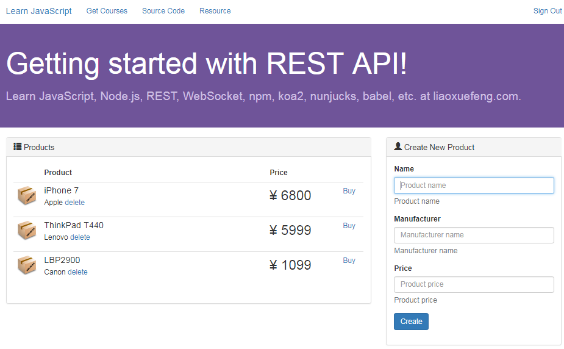

# REST

REST是一种设计API的模式。最常用的数据格式是JSON。由于JSON能直接被JavaScript读取，所以，以JSON格式编写的REST风格的API具有简单、易读、易用的特点。

编写API有什么好处呢？由于API就是把Web App的功能全部封装了，所以，通过API操作数据，可以极大地把前端和后端的代码隔离，使得后端代码易于测试，前端代码编写更简单。

此外，如果我们把前端页面看作是一种用于展示的客户端，那么API就是为客户端提供数据、操作数据的接口。这种设计可以获得极高的扩展性。例如，当用户需要在手机上购买商品时，只需要开发针对iOS和Android的两个客户端，通过客户端访问API，就可以完成通过浏览器页面提供的功能，而后端代码基本无需改动。

当一个Web应用以API的形式对外提供功能时，整个应用的结构就扩展为：


把网页视为一种客户端，是REST架构可扩展的一个关键。

## REST API URL规范

编写REST API，实际上就是编写处理HTTP请求的async函数，不过，REST请求和普通的HTTP请求有几个特殊的地方：

1. 除了GET请求外，POST、PUT等请求的body是JSON数据格式`Content-Type`为`application/json`；
2. REST响应返回的结果是JSON数据格式，响应的`Content-Type`也是`application/json`。

REST规范定义了资源的通用访问格式，虽然它不是一个强制要求，但遵守该规范可以让人易于理解。

例如，商品Product就是一种资源。获取所有Product的URL如下：

```
GET /api/products
```

而获取某个指定的Product，例如，id为`123`的Product，其URL如下：

```
GET /api/products/123

```

新建一个Product使用POST请求，JSON数据包含在body中，URL如下：

```
POST /api/products

```

更新一个Product使用PUT请求，例如，更新id为`123`的Product，其URL如下：

```
PUT /api/products/123

```

删除一个Product使用DELETE请求，例如，删除id为`123`的Product，其URL如下：

```
DELETE /api/products/123

```

资源还可以按层次组织。例如，获取某个Product的所有评论，使用：

```
GET /api/products/123/reviews

```

当我们只需要获取部分数据时，可通过参数限制返回的结果集，例如，返回第2页评论，每页10项，按时间排序：

```
GET /api/products/123/reviews?page=2&size=10&sort=time

```

## koa处理REST

`rest-hello`的工程结构如下：

```
rest-hello/
|
+- controllers/
|  |
|  +- api.js <-- REST API
|
+- app.js <-- 使用koa的js
|
+- controller.js <-- 扫描注册Controller
|
+- package.json <-- 项目描述文件
|
+- node_modules/ <-- npm安装的所有依赖包

```

在`package.json`中，需要如下依赖包：

```json
"dependencies": {
    "koa": "2.11.0",
    "koa-bodyparser": "3.2.0",
    "koa-router": "7.0.0",
}

```

在`app.js`中，仍然使用标准的koa组件，并自动扫描加载`controllers`目录下的所有js文件：

```javascript
const app = new Koa();
const controller = require('./controller');

// parse request body:
app.use(bodyParser());
// add controller:
app.use(controller());
app.listen(3000);
console.log('app started at port 3000...');

```

`app.use(bodyParser());`给koa安装了一个解析HTTP请求body的处理函数。如果HTTP请求是JSON数据，就可以通过`ctx.request.body`直接访问解析后的JavaScript对象。

编写`api.js`，添加一个GET请求：

```javascript
// 存储Product列表，相当于模拟数据库:
var products = [{
    name: 'iPhone',
    price: 6999
}, {
    name: 'Kindle',
    price: 999
}];

module.exports = {
    'GET /api/products': async (ctx, next) => {
        // 设置Content-Type:
        ctx.response.type = 'application/json';
        // 设置Response Body:
        ctx.response.body = {
            products: products
        };
    }
}

```

在koa中，只需要给`ctx.response.body`赋值一个JavaScript对象，koa会自动把该对象序列化为JSON并输出到客户端。

我们在浏览器中访问`http://localhost:3000/api/products`，可以得到如下输出：

```json
{"products":[{"name":"iPhone","price":6999},{"name":"Kindle","price":999}]}

```

再添加一个创建Product的API：

```javascript
module.exports = {
    'GET /api/products': async (ctx, next) => {
        //...
    },
    
    'POST /api/products': async (ctx, next) => {
        var p = {
            name: ctx.request.body.name,
            price: ctx.request.body.price
        };
        products.push(p);
        ctx.response.type = 'application/json';
        ctx.response.body = p;
    }
};

```

这个POST请求无法在浏览器中直接测试。但是可以通过`curl`命令在命令提示符窗口测试这个API:

```bash
curl -H 'Content-Type: application/json' -X POST -d '{"name":"XBox","price":3999}' http://localhost:3000/api/products

```

得到的返回内容如下：

```json
{"name":"XBox","price":3999}

```

我们再在浏览器中访问`http://localhost:3000/api/products`，可以得到更新后的输出如下：

```json
{"products":[{"name":"iPhone","price":6999},{"name":"Kindle","price":999},{"name":"XBox","price":3999}]}

```

可见，在koa中处理REST请求是非常简单的。`bodyParser()`这个middleware可以解析请求的JSON数据并绑定到`ctx.request.body`上，输出JSON时我们先指定`ctx.response.type = 'application/json'`，然后把JavaScript对象赋值给`ctx.response.body`就完成了REST请求的处理。

## REST API接口规范

使用REST和使用MVC是类似的，不同的是，提供REST的Controller处理函数最后不调用`render()`去渲染模板，而是把结果直接用JSON序列化返回给客户端。

使用REST虽然非常简单，但是，设计一套合理的REST框架却需要仔细考虑很多问题。

### 问题一：如何组织URL

在实际工程中，一个Web应用既有REST，还有MVC，可能还需要集成其他第三方系统。如何组织URL？

一个简单的方法是通过固定的前缀区分。例如，`/static/`开头的URL是静态资源文件，类似的，`/api/`开头的URL就是REST API，其他URL是普通的MVC请求。

使用不同的子域名也可以区分，但对于中小项目来说配置麻烦。随着项目的扩大，将来仍然可以把单域名拆成多域名。

### 问题二：如何统一输出REST

可以通过一个middleware给`ctx`添加一个`rest()`方法，直接输出JSON数据。

给所有REST API一个固定的URL前缀`/api/`，这样这个middleware就可以根据path来判断当前请求是否是一个REST请求，如果是才给`ctx`绑定`rest()`方法。

编写这个middleware`rest.js`：

```javascript
module.exports = {
    restify: (pathPrefix) => {
        // REST API前缀，默认为/api/:
        pathPrefix = pathPrefix || '/api/';
        return async (ctx, next) => {
            // 是否是REST API前缀?
            if (ctx.request.path.startsWith(pathPrefix)) {
                // 绑定rest()方法:
                ctx.rest = (data) => {
                    ctx.response.type = 'application/json';
                    ctx.response.body = data;
                }
                await next();
            } else {
                await next();
            }
        };
    }
};

```

这样，任何支持REST的异步函数只需要简单地调用：

```
ctx.rest({
    data: 123
});

```

就完成了REST请求的处理。

### 问题三：如何处理错误

1. 当REST API请求出错时，如何返回错误信息？
2. 当客户端收到REST响应后，如何判断是成功还是错误？

这两个问题必须统一考虑。

在涉及到REST API的错误时，客户端会遇到`服务器错误`或`业务逻辑错误`两种类型的REST API错误：

服务器错误是类似403，404，500等错误，针对这种类型的错误，客户端除了提示用户“出现了网络错误，稍后重试”以外，并无法获得具体的错误信息。

业务逻辑的错误包括，输入了不合法的Email地址，试图删除一个不存在的Product，等等。这种类型的错误完全可以通过JSON返回给客户端，这样，客户端可以根据错误信息提示用户“Email不合法”等，以便用户修复后重新请求API。

第一类的错误客户端可以通过服务器返回的响应码识别。

第二类的错误，服务器可以返回一个JSON字符串告诉客户端具体的错误原因，例如：

```
{
    "code": "10000",
    "message": "Bad email address"
}

```

为了简化开发，对所有的错误的REST统一响应`400`响应码。`200`表示成功响应，`400`表示失败响应。

### 问题四：如何定义错误码

使用数字作为错误码时，API提供者需要维护一份错误码代码说明表，并且，该文档必须时刻与API发布同步，否则，客户端开发者遇到一个文档上没有写明的错误码，就完全不知道发生了什么错误。

为了方便可以使用字符串作为错误码，最大的好处在于不用查表，根据字面意思也能猜个八九不离十。例如，YouTube API如果返回一个错误`authError`，基本上能猜到是因为认证失败。

我们定义的REST API错误格式如下：

```json
{
    "code": "错误代码",
    "message": "错误描述信息"
}

```

其中，错误代码命名规范为`大类:子类`，例如，口令不匹配的登录错误代码为`auth:bad_password`，用户名不存在的登录错误代码为`auth:user_not_found`。这样，客户端既可以简单匹配某个类别的错误，也可以精确匹配某个特定的错误。

### 问题五：如何返回错误

如果一个REST异步函数想要返回错误，一个直观的想法是调用`ctx.rest()`：

```javascript
user = processLogin(username, password);
if (user != null) {
    ctx.rest(user);
} else {
    ctx.response.status = 400;
    ctx.rest({
        code: 'auth:user_not_found',
        message: 'user not found'
    });
}

```

这种方式不好，因为控制流程会混乱，而且，错误只能在Controller函数中输出。

更好的方式是异步函数直接用`throw`语句抛出错误，让middleware去处理错误：

```
user = processLogin(username, password);
if (user != null) {
    ctx.rest(user);
} else {
    throw new APIError('auth:user_not_found', 'user not found');
}

```

这种方式可以在异步函数的任何地方抛出错误，包括调用的子函数内部。

让middleware处理错误：

```javascript
module.exports = {
    APIError: function (code, message) {
        this.code = code || 'internal:unknown_error';
        this.message = message || '';
    },
    restify: (pathPrefix) => {
        pathPrefix = pathPrefix || '/api/';
        return async (ctx, next) => {
            if (ctx.request.path.startsWith(pathPrefix)) {
                // 绑定rest()方法:
                ctx.rest = (data) => {
                    ctx.response.type = 'application/json';
                    ctx.response.body = data;
                }
                try {
                    await next();
                } catch (e) {
                    // 返回错误:
                    ctx.response.status = 400;
                    ctx.response.type = 'application/json';
                    ctx.response.body = {
                        code: e.code || 'internal:unknown_error',
                        message: e.message || ''
                    };
                }
            } else {
                await next();
            }
        };
    }
};

```

这个错误处理的好处在于，不但简化了Controller的错误处理（只需要throw，其他不管），并且，在遇到非APIError的错误时，自动转换错误码为`internal:unknown_error`。

受益于async/await语法，在middleware中可以直接用`try...catch`捕获异常。如果是callback模式，就无法用`try...catch`捕获，代码结构将混乱得多。

最后，顺便把`APIError`这个对象export出去。

## 开发REST API

先根据`rest-hello`和`view-koa`来创建一个`rest-hello`的工程，结构如下：

```
rest-koa/
|
+- controllers/
|  |
|  +- api.js <-- REST API
|  |
|  +- index.js <-- MVC Controllers
|
+- products.js <-- 集中处理Product
|
+- rest.js <-- 支持REST的middleware
|
+- app.js <-- 使用koa的js
|
+- controller.js <-- 扫描注册Controller
|
+- static-files.js <-- 支持静态文件的middleware
|
+- templating.js <-- 支持Nunjucks的middleware
|
+- package.json <-- 项目描述文件
|
+- views/ <-- Nunjucks模板
|
+- static/ <-- 静态资源文件
|
+- node_modules/ <-- npm安装的所有依赖包

```

`package.json`添加的依赖：

```json
"dependencies": {
    "koa": "2.11.0",
    "koa-bodyparser": "3.2.0",
    "koa-router": "7.0.0",
    "nunjucks": "2.4.2",
    "mime": "1.3.4",
    "mz": "2.4.0"
}

```

这个工程中约定了如下规范：

1. REST API的返回值全部是object对象，而不是简单的number、boolean、null或者数组；
2. REST API必须使用前缀`/api/`。

第一条规是为了方便客户端处理结果，如果返回结果不是object，则客户端反序列化后还需要判断类型。

### Service

为了操作Product，用`products.js`封装所有操作，可以把它视为一个Service：

```javascript
var id = 0;

function nextId() {
    id++;
    return 'p' + id;
}
function Product(name, manufacturer, price) {
    this.id = nextId();
    this.name = name;
    this.manufacturer = manufacturer;
    this.price = price;
}
var products = [
    new Product('iPhone 7', 'Apple', 6800),
    new Product('ThinkPad T440', 'Lenovo', 5999),
    new Product('LBP2900', 'Canon', 1099)
];

module.exports = {
    getProducts: () => {
        return products;
    },
    getProduct: (id) => {
        var i;
        for (i = 0; i < products.length; i++) {
            if (products[i].id === id) {
                return products[i];
            }
        }
        return null;
    },
    createProduct: (name, manufacturer, price) => {
        var p = new Product(name, manufacturer, price);
        products.push(p);
        return p;
    },
    deleteProduct: (id) => {
        var
            index = -1,
            i;
        for (i = 0; i < products.length; i++) {
            if (products[i].id === id) {
                index = i;
                break;
            }
        }
        if (index >= 0) {
            // remove products[index]:
            return products.splice(index, 1)[0];
        }
        return null;
    }
};

```

变量`products`相当于在内存中模拟了数据库，这里是为了简化逻辑。

### API

编写`api.js`，并放到`controllers`目录下：

```javascript
const products = require('../products');
const APIError = require('../rest').APIError;

module.exports = {
    'GET /api/products': async (ctx, next) => {
        ctx.rest({
            products: products.getProducts()
        });
    },
    'POST /api/products': async (ctx, next) => {
        var p = products.createProduct(ctx.request.body.name, ctx.request.body.manufacturer, parseFloat(ctx.request.body.price));
        ctx.rest(p);
    },
    'DELETE /api/products/:id': async (ctx, next) => {
        console.log(`delete product ${ctx.params.id}...`);
        var p = products.deleteProduct(ctx.params.id);
        if (p) {
            ctx.rest(p);
        } else {
            throw new APIError('product:not_found', 'product not found by id.');
        }
    }
};

```

该API支持GET、POST和DELETE这三个请求。当然，还可以添加更多的API。

编写API时，需要注意：

如果客户端传递了JSON格式的数据（例如，POST请求），则async函数可以通过`ctx.request.body`直接访问已经反序列化的JavaScript对象。这是由`bodyParser()`这个middleware完成的。如果`ctx.request.body`为`undefined`，说明缺少middleware，或者middleware没有正确配置。

如果API路径有多个参数，例如，`/api/products/:pid/reviews/:rid`，则这两个参数分别用`ctx.params.pid`和`ctx.params.rid`获取。这个功能由koa-router这个middleware提供。API路径的参数永远是字符串！

### MVC

有了API以后，就可以编写MVC，在页面上调用API完成操作。

先在`controllers`目录下创建`index.js`，编写页面入口函数：

```javascript
module.exports = {
    'GET /': async (ctx, next) => {
        ctx.render('index.html');
    }
};

```

在`views`目录下创建`index.html`，编写JavaScript代码读取Products：

```javascript
$(function () {
    var vm = new Vue({
        el: '#product-list',
        data: {
            products: []
        }
    });
    $.getJSON('/api/products').done(function (data) {
        vm.products = data.products;
    }).fail(function (jqXHR, textStatus) {
        alert('Error: ' + jqXHR.status);
    });
});

```

与VM对应的HTML如下：

```html
<table id="product-list" class="table table-hover">
    <thead>
        <tr>
            <th style="width:50px"></th>
            <th>Product</th>
            <th style="width:150px">Price</th>
        </tr>
    </thead>
    <tbody>
        <tr v-for="p in products">
            <td>
                
            </td>
            <td>
                <h4 class="media-heading" v-text="p.name"></h4>
                <p><span v-text="p.manufacturer"></span></p>
            </td>
            <td>
                <p style="font-size:2em">¥ <span v-text="p.price"></span></p>
            </td>
        </tr>
    </tbody>
</table>
```

当products变化时，Vue会自动更新表格的内容。

类似的，可以添加创建和删除Product的功能，并且刷新变量`products`的内容，就可以实时更新Product列表。

最终的页面效果如下：



右侧可以通过`POST /api/products`创建新的Product，左侧可以通过`GET /api/products`列出所有Product，并且还可以通过`DELETE /api/products/`来删除某个Product。

