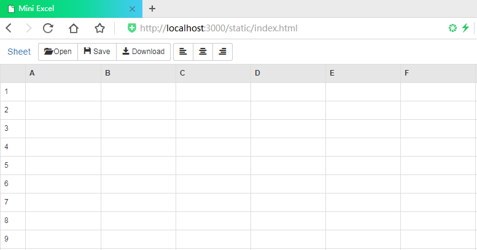

# MVVM

[MVVM](https://en.wikipedia.org/wiki/Model–view–viewmodel)是Model-View-ViewModel的缩写。 

MVVM最早由微软提出来，它借鉴了桌面应用程序的MVC思想，在前端页面中，把Model用纯JavaScript对象表示，View负责显示，两者做到了最大限度的分离。

把Model和View关联起来的就是ViewModel。ViewModel负责把Model的数据同步到View显示出来，还负责把View的修改同步回Model。

用JavaScript编写一个通用的ViewModel，这样，就可以复用整个MVVM模型了。

先看用jQuery实现的修改两个DOM节点的例子：

```html
<!-- HTML -->
<p>Hello, <span id="name">Bart</span>!</p>
<p>You are <span id="age">12</span>.</p>
```

用jQuery修改name和age节点的内容：

```javascript
var name = 'Homer';
var age = 51;
$('#name').text(name);
$('#age').text(age);
```

如果使用MVVM框架来实现同样的功能，并不需要关心DOM的结构，而是关心数据如何存储。最简单的数据存储方式是使用JavaScript对象：

```javascript
var person = {
    name: 'Bart',
    age: 12
};
```

把变量`person`看作Model，把HTML某些DOM节点看作View，并假定它们之间被关联起来了。

要把显示的name从`Bart`改为`Homer`，把显示的age从`12`改为`51`并不操作DOM，而是直接修改JavaScript对象：

```javascript
person.name = 'Homer';
person.age = 51;
```

MVVM的设计思想就是关注Model的变化，让MVVM框架去自动更新DOM的状态，从而让开发者从操作DOM的繁琐步骤中解脱出来！ 

## 单向绑定

MVVM就是在前端页面上，应用了扩展的MVC模式，MVVM框架自动把Model的变化映射到DOM结构上，这样，用户看到的页面内容就会随着Model的变化而更新。

例如，我们定义好一个JavaScript对象作为Model，并且把这个Model的两个属性绑定到DOM节点上：


经过MVVM框架的自动转换，浏览器就可以直接显示Model的数据了：


目前，常用的MVVM框架有：

[Angular](https://angularjs.org/)：Google出品，名气大，但是很难用；

[Backbone.js](http://backbonejs.org/)：入门非常困难，因为自身API太多；

[Ember](http://emberjs.com/)：一个大而全的框架，想写个Hello world都很困难。

选择MVVM的目标应该是入门容易，安装简单，能直接在页面写JavaScript，需要更复杂的功能时又能扩展支持。

所以，综合考察，最佳选择是[尤雨溪](http://weibo.com/p/1005051761511274)大佬开发的[Vue.js](http://vuejs.org/)

首先创建基于koa的Node.js项目。虽然目前只需要在HTML静态页面中编写MVVM，但是很快就需要和后端API进行交互，因此，要创建基于koa的项目结构如下：

```
hello-vue/
|
+- app.js <-- koa app
|
+- static-files.js <-- 支持静态文件的koa middleware
|
+- package.json <-- 项目描述文件
|
+- node_modules/ <-- npm安装的所有依赖包
|
+- static/ <-- 存放静态资源文件
   |
   +- css/ <-- 存放bootstrap.css等
   |
   +- fonts/ <-- 存放字体文件
   |
   +- js/ <-- 存放各种js文件
   |
   +- index.html <-- 使用MVVM的静态页面
```

这个Node.js项目的主要目的是作为服务器输出静态网页，因此，`package.json`仅需要如下依赖包：

```json
"dependencies": {
    "koa": "2.11.0",
    "mime": "1.3.4",
    "mz": "2.4.0"
}
```

使用`npm install`安装好依赖包，然后启动`app.js`，在`index.html`文件中随便写点内容，确保浏览器可以通过`http://localhost:3000/static/index.html`访问到该静态文件。

### 引用Vue

安装Vue有很多方法，可以用npm或者webpack。但是现在的目标是尽快用起来，所以最简单的方法是直接在HTML代码中引用Vue。可以直接使用CDN的地址，例如：

```html
<script src="https://unpkg.com/vue@2.0.1/dist/vue.js"></script>
```

也可以把`vue.js`文件下载下来，放到项目的`/static/js`文件夹中，使用本地路径：

```html
<script src="/static/js/vue.js"></script>
```

这里的`vue.js`是未压缩的用于开发的版本，它会在浏览器console中输出很多有用的信息，帮助我们调试代码。当开发完毕，需要真正发布到服务器时，应该使用压缩过的`vue.min.js`，它会移除所有调试信息，并且文件体积更小。

### 编写MVVM

Vue将Model和View关联起来。Model是一个JavaScript对象，View是负责显示的是DOM节点。

如果DOM节点尚未被浏览器加载完，MVVM初始化将失败，所以可以使用jQuery把MVVM的初始化代码推迟到页面加载完毕后执行：

```html
<html>
<head>
<!-- 引用jQuery -->
<script src="/static/js/jquery.min.js"></script>
<!-- 引用Vue -->
<script src="/static/js/vue.js"></script>

<script>
// 初始化代码:
$(function () {
    var vm = new Vue({
        el: '#vm',
        data: {
            name: 'Robot',
            age: 15
        }
    });
    window.vm = vm;
});
</script>
</head>
<body>
    <div id="vm">
        <p>Hello, {{ name }}!</p>
        <p>You are {{ age }} years old!</p>
    </div>
</body>
<html>
```

VM的核心代码如下：

```javascript
var vm = new Vue({
    el: '#vm',
    data: {
        name: 'Robot',
        age: 15
    }
});
```

其中，`el`指定了要把Model绑定到哪个DOM根节点上，`'#vm'`对应ID为`vm`的一个`  <div>  `节点。被绑定的的节点就是Vue可以操作的View，Vue可以自动把Model的状态映射到View上。

`data`属性指定了Model，初始化了Model的两个属性`name`和`age`，在View内部的`<p>`节点上，可以直接用`{{ name }}`引用Model的某个属性。

一切正常的话，在浏览器中访问`http://localhost:3000/static/index.html`，可以看到页面输出为：

```
Hello, Robot!
You are 15 years old!
```

由于已经用代码`window.vm = vm`把VM变量绑定到了window对象上，所以可以直接在浏览器console修改VM的Model：

```javascript
window.vm.name = 'Bob'
```

浏览器console上执行上述代码后，页面原来的`Hello, Robot!`自动变成了`Hello, Bob!`。Vue作为MVVM框架会自动监听Model的任何变化，在Model数据变化时，更新View的显示。这种Model到View的绑定称为**单向绑定**。

在Vue中，可以直接写`{{ name }}`绑定某个属性。如果属性关联的是对象，还可以用多个`.`引用，例如，`{{ address.zipcode }}`。

另一种单向绑定的方法是使用Vue的指令`v-text`，写法如下：

```html
<p>Hello, <span v-text="name"></span>!</p>
```

这种写法是把指令写在HTML节点的属性上，它会被Vue解析，该节点的文本内容会被绑定为Model的指定属性，z这种写法不能再写双花括号`{{ }}`。

## 双向绑定

单向绑定就是把Model绑定到View，更新Model时，View就会自动更新。

如果用户更新了View，Model的数据也自动被更新了，这种情况就是双向绑定。

填写表单就是更新View状态的一个最直接的例子，如果此时MVVM框架可以自动更新Model的状态，那就相当于把Model和View做了双向绑定：


仍然先创建一个VM实例：

```javascript
$(function () {
    var vm = new Vue({
        el: '#vm',
        data: {
            email: '',
            name: ''
        }
    });
    window.vm = vm;
});
```

编写一个HTML FORM表单，并用`v-model`指令把某个`<input>`和Model的某个属性作双向绑定：

```html
<form id="vm" action="#">
    <p><input v-model="email"></p>
    <p><input v-model="name"></p>
</form>
```

在表单中输入内容，然后在浏览器console中用`window.vm.$data`查看Model的内容，也可以用`window.vm.name`查看Model的`name`属性，它的值和FORM表单对应的` <input> `是一致的。

如果在浏览器console中执行`window.vm.name='Bob'`，表单对应的内容也会立刻更新。

除了`<input type="text">`可以和字符串类型的属性绑定外，其他类型的` <input> `也可以和相应数据类型绑定：

多个checkbox可以和数组绑定：

```html
<label><input type="checkbox" v-model="language" value="zh"> Chinese</label>
<label><input type="checkbox" v-model="language" value="en"> English</label>
<label><input type="checkbox" v-model="language" value="fr"> French</label>
```

对应的Model为：

```
language: ['zh', 'en']
```

单个checkbox可以和boolean类型变量绑定：

```html
<input type="checkbox" v-model="subscribe">
```

对应的Model为：

```
subscribe: true; // 根据checkbox是否选中为true/false
```

下拉框`<select>`绑定的是对应value的字符串：

```html
<select v-model="city">
    <option value="bj">Beijing</option>
    <option value="sh">Shanghai</option>
    <option value="gz">Guangzhou</option>
</select>
```

对应的Model为：

```json
city: 'bj' // 对应option的value
```

双向绑定最大的好处是不再需要用jQuery去查询表单的状态，而是直接获得了用JavaScript对象表示的Model。

### 处理事件

当用户提交表单时，传统的做法是响应`onsubmit`事件，用jQuery获取表单内容，检查输入是否有效，最后提交表单，或者用AJAX提交表单。现在，获取表单内容已经不需要了，因为双向绑定直接获得了表单内容，并且获得了合适的数据类型。

响应`onsubmit`事件也可以放到VM中，在`<form>`元素上使用指令：

```html
<form id="vm" v-on:submit.prevent="register">
```

其中，`v-on:submit="register"`指令就会自动监听表单的`submit`事件，并调用`register`方法处理该事件。使用`.prevent`表示阻止事件冒泡，这样，浏览器不再处理` <form> `的`submit`事件。

指定的事件处理函数`register`需要写入到Vue对象中：

```javascript
var vm = new Vue({
    el: '#vm',
    data: {
        ...
    },
    methods: {
        register: function () {
            // 显示JSON格式的Model:
            alert(JSON.stringify(this.$data));
            // TODO: AJAX POST...
        }
    }
});
```

在`register()`函数内部，可以用AJAX把JSON格式的Model发送给服务器，就完成了用户注册的功能。

## 同步DOM结构

除了简单的单向绑定和双向绑定，MVVM还有一个重要的用途，就是让Model和DOM的结构保持同步。

用一个TODO的列表作为示例，从用户角度看，一个TODO列表在DOM结构的表现形式就是一组` <li> `节点：

```html
<ol>
    <li>
        <dl>
            <dt>产品评审</dt>
            <dd>新款iPhone上市前评审</dd>
        </dl>
    </li>
    <li>
        <dl>
            <dt>开发计划</dt>
            <dd>与PM确定下一版Android开发计划</dd>
        </dl>
    </li>
    <li>
        <dl>
            <dt>VC会议</dt>
            <dd>敲定C轮5000万美元融资</dd>
        </dl>
    </li>
</ol>
```

而对应的Model可以用JavaScript数组表示：

```javascript
todos: [
    {
        name: '产品评审',
        description: '新款iPhone上市前评审'
    },
    {
        name: '开发计划',
        description: '与PM确定下一版Android开发计划'
    },
    {
        name: 'VC会议',
        description: '敲定C轮5000万美元融资'
    }
]
```

使用MVVM时，DOM结构会随着Model的变化而自动更新。当`todos`数组增加或删除元素时，相应的DOM节点会增加`<li>`或者删除`<li>`节点。

在Vue中，可以使用`v-for`指令来实现：

```html
<ol>
    <li v-for="t in todos">
        <dl>
            <dt>{{ t.name }}</dt>
            <dd>{{ t.description }}</dd>
        </dl>
    </li>
</ol>
```

`v-for`指令把数组和一组` <li> `元素绑定了。在` <li> `元素内部，用循环变量`t`引用某个属性，例如，`{{ t.name }}`。这样，只关心如何更新Model，不关心如何增删DOM节点，大大简化了整个页面的逻辑。

可以在浏览器console中用`window.vm.todos[0].name='计划有变'`查看View的变化，或者通过`window.vm.todos.push({name:'新计划',description:'blabla...'})`来增加一个数组元素，从而自动添加一个` <li> `元素。

需要注意的是，Vue之所以能够监听Model状态的变化，是因为JavaScript语言本身提供了[Proxy](https://developer.mozilla.org/en-US/docs/Web/JavaScript/Reference/Global_Objects/Proxy)或者[Object.observe()](https://developer.mozilla.org/en-US/docs/Web/JavaScript/Reference/Global_Objects/Object/observe)机制来监听对象状态的变化。但是，对于数组元素的赋值，却没有办法直接监听，因此直接对数组元素赋值：

```javascript
vm.todos[0] = {
    name: 'New name',
    description: 'New description'
};
```

会导致Vue无法更新View。

正确的方法是不要对数组元素赋值，而是更新：

```javascript
vm.todos[0].name = 'New name';
vm.todos[0].description = 'New description';
```

或者，通过`splice()`方法，删除某个元素后，再添加一个元素，达到“赋值”的效果：

```javascript
var index = 0;
var newElement = {...};
vm.todos.splice(index, 1, newElement);
```

Vue可以监听数组的`splice`、`push`、`unshift`等方法调用，所以，上述代码可以正确更新View。

## 集成API

在上一节中用Vue实现了一个简单的TODO应用。通过对Model的更新，DOM结构可以同步更新。

现在，如果要把这个简单的TODO应用变成一个用户能使用的Web应用，需要解决几个问题：

1. 用户的TODO数据应该从后台读取；
2. 对TODO的增删改必须同步到服务器后端；
3. 用户在View上必须能够修改TODO。

第1个和第2个问题都是和API相关的。只要我们实现了合适的API接口，就可以在MVVM内部更新Model的同时，通过API把数据更新反映到服务器端，这样，用户数据就保存到了服务器端，下次打开页面时就可以读取TODO列表。

创建`vue-todo-2`项目，结构如下：

```
vue-todo-2/
|
+- app.js <-- koa app
|
+- static-files.js <-- 支持静态文件的koa middleware
|
+- controller.js <-- 支持路由的koa middleware
|
+- rest.js <-- 支持REST的koa middleware
|
+- package.json <-- 项目描述文件
|
+- node_modules/ <-- npm安装的所有依赖包
|
+- controllers/ <-- 存放Controller
|  |
|  +- api.js <-- REST API
|
+- static/ <-- 存放静态资源文件
   |
   +- css/ <-- 存放bootstrap.css等
   |
   +- fonts/ <-- 存放字体文件
   |
   +- js/ <-- 存放各种js文件
   |
   +- index.html <-- 使用MVVM的静态页面
```

在`api.js`文件中，用数组在服务器端模拟一个数据库，然后实现以下4个API：

- GET /api/todos：返回所有TODO列表；
- POST /api/todos：创建一个新的TODO，并返回创建后的对象；
- PUT /api/todos/:id：更新一个TODO，并返回更新后的对象；
- DELETE /api/todos/:id：删除一个TODO。

和前面的TODO数据结构相比，需要增加一个`id`属性，来唯一标识一个TODO。

把Model的更新同步到服务器端有两个方法：

第一个方法是直接用jQuery的AJAX调用REST API，不过这种方式比较麻烦。

第二个方法是使用[vue-resource](https://github.com/vuejs/vue-resource)这个针对Vue的扩展，它可以给VM对象加上一个`$resource`属性，通过`$resource`来方便地操作API。

使用vue-resource只需要在导入vue.js后，加一行`  <script>  `导入`vue-resource.min.js`文件即可。可以直接使用CDN的地址：

```html
<script src="https://cdn.jsdelivr.net/vue.resource/1.0.3/vue-resource.min.js"></script>
```

我们给VM增加一个`init()`方法，读取TODO列表：

```javascript
var vm = new Vue({
    el: '#vm',
    data: {
        title: 'TODO List',
        todos: []
    },
    created: function () {
        this.init();
    },
    methods: {
        init: function () {
            var that = this;
            that.$resource('/api/todos').get().then(function (resp) {
                // 调用API成功时调用json()异步返回结果:
                resp.json().then(function (result) {
                    // 更新VM的todos:
                    that.todos = result.todos;
                });
            }, function (resp) {
                // 调用API失败:
                alert('error');
            });
        }
    }
});
```

`created`指定了当VM初始化成功后的回调函数，`init()`方法会在VM初始化成功后被自动调用。

类似的，对于添加、修改、删除的操作，也需要往VM中添加对应的函数。以添加为例：

```javascript
var vm = new Vue({
    ...
    methods: {
        ...
        create: function (todo) {
            var that = this;
            that.$resource('/api/todos').save(todo).then(function (resp) {
                resp.json().then(function (result) {
                    that.todos.push(result);
                });
            }, showError);
        },
        update: function (todo, prop, e) {
            ...
        },
        remove: function (todo) {
            ...
        }
    }
});
```

添加操作需要一个额外的表单可以创建另一个VM对象`vmAdd`来对表单作双向绑定，然后，在提交表单的事件中调用`vm`对象的`create`方法：

```javascript
var vmAdd = new Vue({
    el: '#vmAdd',
    data: {
        name: '',
        description: ''
    },
    methods: {
        submit: function () {
            vm.create(this.$data);
        }
    }
});
```

`vmAdd`和FORM表单绑定：

```html
<form id="vmAdd" action="#0" v-on:submit.prevent="submit">
    <p><input type="text" v-model="name"></p>
    <p><input type="text" v-model="description"></p>
    <p><button type="submit">Add</button></p>
</form>
```

最后，把`vm`绑定到对应的DOM：

```html
<div id="vm">
    <h3>{{ title }}</h3>
    <ol>
        <li v-for="t in todos">
            <dl>
                <dt contenteditable="true" v-on:blur="update(t, 'name', $event)">{{ t.name }}</dt>
                <dd contenteditable="true" v-on:blur="update(t, 'description', $event)">{{ t.description }}</dd>
                <dd><a href="#0" v-on:click="remove(t)">Delete</a></dd>
            </dl>
        </li>
    </ol>
</div>
```

这里用`contenteditable="true"`让DOM节点变成可编辑的，用`v-on:blur="update(t, 'name', $event)"`在编辑结束时调用`update()`方法并传入参数，特殊变量`$event`表示DOM事件本身。

删除TODO是通过对`<a>`节点绑定`v-on:click`事件并调用`remove()`方法实现的。

## MVVM的适用范围

MVVM最大的优势是编写前端逻辑非常复杂的页面，尤其是需要大量DOM操作的逻辑，利用MVVM可以极大地简化前端页面的逻辑。

MVVM的目的是为了解决复杂的前端逻辑。对于以展示逻辑为主的页面，例如，新闻，博客、文档等，不能使用MVVM展示数据，因为这些页面需要被搜索引擎索引，而搜索引擎无法获取使用MVVM并通过API加载的数据。

所以，需要SEO（Search Engine Optimization）的页面，不能使用MVVM展示数据。不需要SEO的页面，如果前端逻辑复杂，就适合使用MVVM展示数据，例如，工具类页面，复杂的表单页面，用户登录后才能操作的页面等等。

## 简易电子表格

下面演示利用Vue快速创建一个简易在线电子表格：



### 基础结构

定义Model的结构，它的主要数据就是一个二维数组，每个单元格用一个JavaScript对象表示：

```javascript
data: {
    title: 'New Sheet',
    header: [ // 对应首行 A, B, C...
        { row: 0, col: 0, text: '' },
        { row: 0, col: 1, text: 'A' },
        { row: 0, col: 2, text: 'B' },
        { row: 0, col: 3, text: 'C' },
        ...
        { row: 0, col: 10, text: 'J' }
    ],
    rows: [
        [
        	{ row: 1, col: 0, text: '1' },
        	{ row: 1, col: 1, text: '' },
        	{ row: 1, col: 2, text: '' },
            ...
        	{ row: 1, col: 10, text: '' },
        ],
        [
        	{ row: 2, col: 0, text: '2' },
        	{ row: 2, col: 1, text: '' },
        	{ row: 2, col: 2, text: '' },
            ...
        	{ row: 2, col: 10, text: '' },
        ],
        ...
        [
        	{ row: 10, col: 0, text: '10' },
        	{ row: 10, col: 1, text: '' },
        	{ row: 10, col: 2, text: '' },
            ...
        	{ row: 10, col: 10, text: '' },
        ]
    ],
    selectedRowIndex: 0, // 当前活动单元格的row
    selectedColIndex: 0 // 当前活动单元格的col
}
```

把Model的结构映射到一个`  <table>  `上：

```html
<table id="sheet">
    <thead>
        <tr>
            <th v-for="cell in header" v-text="cell.text"></th>
        </tr>
    </thead>
    <tbody>
        <tr v-for="tr in rows">
            <td v-for="cell in tr" v-text="cell.text"></td>
        </tr>
    </tbody>
</table>
```

现在，用Vue把Model和View关联起来，这个电子表格的原型已经可以运行了！

### 文本编辑

在EXCEL表格中首行和首列的单元格不可以被编辑的。

为了使单元格可以编辑，使用`v-bind`指令给每个单元格对象加上`contentEditable`属性，但首列的单元格不可以被编辑的，于是使用`cell.contentEditable`的值控制当前单元格是否可以编辑：

```html
<td v-for="cell in tr" v-bind:contenteditable="cell.contentEditable" v-text="cell.text"></td>
```

最后，给`<td>`绑定click事件，记录当前活动单元格的row和col，再绑定blur事件，在单元格内容编辑结束后更新Model：

```html
<td v-for="cell in tr" v-on:click="focus(cell)" v-on:blur="change" ...></td>
```

对应的两个方法要添加到VM中：

```javascript
var vm = new Vue({
    ...
    methods: {
        focus: function (cell) {
            this.selectedRowIndex = cell.row;
            this.selectedColIndex = cell.col;
        },
        change: function (e) {
            // change事件传入的e是DOM事件
            var
                rowIndex = this.selectedRowIndex,
                colIndex = this.selectedColIndex,
                text;
            if (rowIndex > 0 && colIndex > 0) {
                text = e.target.innerText; // 获取td的innerText
                this.rows[rowIndex - 1][colIndex].text = text;
            }
        }
    }
});
```

现在，单元格已经可以编辑，并且用户的输入会自动更新到Model中。

### 对齐功能

如果要给单元格的文本添加格式，例如，左对齐或右对齐，可以给Model对应的对象添加一个`align`属性，然后用`v-bind:style`绑定到`<td>`上：

```html
<td v-for="cell in tr" ... v-bind:style="{ textAlign: cell.align }"></td>
```

然后，创建工具栏，给左对齐、居中对齐和右对齐按钮编写`click`事件代码，调用`setAlign()`函数：

```javascript
function setAlign(align) {
    var
        rowIndex = vm.selectedRowIndex,
        colIndex = vm.selectedColIndex,
        row, cell;
    if (rowIndex > 0 && colIndex > 0) {
        row = vm.rows[rowIndex - 1];
        cell = row[colIndex];
        cell.align = align;
    }
}

// 给按钮绑定事件:
$('#cmd-left').click(function () { setAlign('left'); });
$('#cmd-center').click(function () { setAlign('center'); });
$('#cmd-right').click(function () { setAlign('right'); });
```

现在，点击某个单元格，再点击右对齐按钮，单元格文本就变成右对齐了。

类似的，可以继续添加其他样式，例如字体、字号等。

# Vue模板语法

 Vue 的目标是通过尽可能简单的 API 实现响应的数据绑定和组合的视图组件。 

对于制作原型或学习，可以这样使用最新版本：

```
<script src="https://cdn.jsdelivr.net/npm/vue/dist/vue.js"></script>
```

对于生产环境，最好链接到一个明确的版本号和构建文件，以避免新版本造成的不可预期的破坏：

```
<script src="https://cdn.jsdelivr.net/npm/vue@2.6.0"></script>
```

 用 `<script>` 标签引入，`Vue` 会被注册为一个全局变量。 

下载地址：https://vuejs.org/js/vue.min.js

## Vue.js基本语法

### 插值

```html
<div id="app">
  <p>{{ message }}</p>
  <div v-html="html"></div>
</div>

<script>
new Vue({
  el: '#app',
  data: {
    message: 'Hello Vue.js!',
    html: '<h1>Vue教程</h1>'
  }
})
</script>
```

` {{...}}`表示的文本插值 ，  `v-html` 指令用于输出 html 代码 。

### 属性绑定

HTML 属性中的值应使用 v-bind 指令。

以下实例当use为true使用div的class被设置为class1，use为false则class被设置为空白：

```html
<div id="app">
  <label for="r1">修改颜色</label><input type="checkbox" v-model="use" id="r1">
  <br>
  <div v-bind:class="{'class1': use}">
    v-bind:class 指令
  </div>
</div>
    
<script>
new Vue({
    el: '#app',
  data:{
      use: false
  }
});
</script>
```

 可以在对象中传入更多属性用来动态切换多个 class ： 

```html
<div id="app">
  <div class="static"
     v-bind:class="{ active: isActive, 'text-danger': hasError }">
  </div>
</div>

<script>
new Vue({
  el: '#app',
  data: {
    isActive: true,
	hasError: true
  }
})
</script>
```

结果为：

```html
<div class="static active text-danger"></div>
```

 也可以绑定返回对象的计算属性： 

```javascript
new Vue({
  el: '#app',
  data: {
    isActive: true,
    error: {
      value: true,
      type: 'fatal'
    }
  },
  computed: {
    classObject: function () {
      return {
  		base: true,
        active: this.isActive && !this.error.value,
        'text-danger': this.error.value && this.error.type === 'fatal',
      }
    }
  }
})
```

渲染结果与上个例子一样。

 还可以使用 数组 和三元表达式， errorClass 是始终存在的，isActive 为 true 时添加 activeClass 类： 

```html
<div v-bind:class="[errorClass ,isActive ? activeClass : '']"></div>
```


### 表达式

Vue.js 都提供了完全的 JavaScript 表达式支持。

```html
<div id="app">
    {{5+5}}<br>
    {{ ok ? 'YES' : 'NO' }}<br>
    {{ message.split('').reverse().join('') }}
    <div v-bind:id="'list-' + id">Vue教程</div>
</div>
    
<script>
new Vue({
  el: '#app',
  data: {
    ok: true,
    message: 'Vue',
    id : 1
  }
})
</script>
```

### 修饰符

修饰符是以半角句号 **.** 指明的特殊后缀，用于指出一个指令应该以特殊方式绑定。例如，**.prevent** 修饰符告诉 **v-on** 指令对于触发的事件调用 **event.preventDefault()**：

```html
<form v-on:submit.prevent="onSubmit"></form>
```

### 双向数据绑定

在 input 输入框中可以使用 v-model 指令来实现双向数据绑定：

```html
<div id="app">
    <p>{{ message }}</p>
    <input v-model="message">
</div>
    
<script>
new Vue({
  el: '#app',
  data: {
    message: 'Runoob!'
  }
})
</script>
```

 **v-model** 指令用来在 input、select、textarea、checkbox、radio 等表单控件元素上创建双向数据绑定，根据表单上的值，自动更新绑定的元素的值。 

 以下实例在用户点击按钮后对字符串进行反转操作： 

```html
<div id="app">
    <p>{{ message }}</p>
    <button v-on:click="reverseMessage">反转字符串</button>
</div>
    
<script>
new Vue({
  el: '#app',
  data: {
    message: 'Runoob!'
  },
  methods: {
    reverseMessage: function () {
      this.message = this.message.split('').reverse().join('')
    }
  }
})
</script>
```

### 过滤器

过滤器允许model在View中显示时进行一些额外处理，以下实例对输入的字符串第一个字母转为大写：

```html
<div id="app">
  {{ message | capitalize }}
</div>
    
<script>
new Vue({
  el: '#app',
  data: {
    message: 'taobao'
  },
  filters: {
    capitalize: function (value) {
      if (!value) return ''
      value = value.toString()
      return value.charAt(0).toUpperCase() + value.slice(1)
    }
  }
})
</script>
```

过滤器可以串联：

```
{{ message | filterA | filterB }}
```

过滤器是 JavaScript 函数，因此可以接受参数：

```
{{ message | filterA('arg1', arg2) }}
```

这里，message 是第一个参数，字符串 'arg1' 将传给过滤器作为第二个参数， arg2 表达式的值将被求值然后传给过滤器作为第三个参数。

### 缩写

Vue.js 为两个最为常用的指令提供了特别的缩写：

```
<!-- 完整语法 -->
<a v-bind:href="url"></a>
<!-- 缩写 -->
<a :href="url"></a>
```

```
<!-- 完整语法 -->
<a v-on:click="doSomething"></a>
<!-- 缩写 -->
<a @click="doSomething"></a>
```

## 流程控制语句

### 条件判断

```html
<div id="app">
    <div v-if="type === 'A'">
      A
    </div>
    <div v-else-if="type === 'B'">
      B
    </div>
    <div v-else-if="type === 'C'">
      C
    </div>
    <div v-else>
      Not A/B/C
    </div>
</div>
    
<script>
new Vue({
  el: '#app',
  data: {
    type: 'C'
  }
})
</script>
```

**v-else 、v-else-if 必须跟在 v-if 或者 v-else-if之后。**

 也可以使用 v-show 指令来根据条件展示元素： 

```html
<h1 v-show="ok">Hello!</h1>
```

### 循环语句

 v-for 可以通过一个对象的属性来迭代数据： 

```html
<div id="app">
  <ul>
    <li v-for="(value, key, index) in object">
     {{ index }}. {{ key }} : {{ value }}
    </li>
  </ul>
</div>

<script>
new Vue({
  el: '#app',
  data: {
    object: {
      name: 'Vue教程',
      url: 'https://cn.vuejs.org/v2/guide/',
      slogan: '学的不仅是技术，更是梦想！'
    }
  }
})
</script>
```

 第二个的参数`key`为键名， 第三个参数`index`为索引，可以省略形如`value in object`。

 v-for 也可以循环整数 ：

```html
<div id="app">
  <ul>
    <li v-for="n in 10"> {{ n }} </li>
  </ul>
</div>
```

n会从1循环到10。

 模板中使用 v-for： 

```html
<ul>
  <template v-for="site in sites">
    <li>{{ site.name }}</li>
    <li>--------------</li>
  </template>
</ul>
```

## Vue.js监听属性

可以监听属性 watch来响应数据的变化。

以下实例通过使用 watch 实现计数器：

```html
<div id = "app">
    <p style = "font-size:25px;">计数器: {{ counter }}</p>
    <button @click = "counter++" style = "font-size:25px;">点我</button>
</div>
<script type = "text/javascript">
var vm = new Vue({
    el: '#app',
    data: {
        counter: 1
    }
});
vm.$watch('counter', function(nval, oval) {
    alert('计数器值的变化 :' + oval + ' 变为 ' + nval + '!');
});
</script>
```

 以下实例进行**千米**与**米**之间的换算： 

```html
<div id = "computed_props">
    千米 : <input type = "text" v-model = "kilometers">
    米 : <input type = "text" v-model = "meters">
</div>
<p id="info"></p>
<script type = "text/javascript">
    var vm = new Vue({
        el: '#computed_props',
        data: {
            kilometers : 0,
            meters:0
        },
        watch : {
            kilometers:function(val) {
                this.kilometers = val;
                this.meters = this.kilometers * 1000
            },
            meters : function (val) {
                this.kilometers = val/ 1000;
                this.meters = val;
            }
        }
    });
</script>
```

watch对象创建了两个监控对应数据变化的方法 kilometers 和 meters 。

## 修饰符

### 事件修饰符

Vue.js 为 v-on 提供了事件修饰符来处理 DOM 事件细节，如：event.preventDefault() 或 event.stopPropagation()。

Vue.js通过由点(.)表示的指令后缀来调用修饰符。

- `.stop`
- `.prevent`
- `.capture`
- `.self`
- `.once`

```html
<!-- 阻止单击事件冒泡 -->
<a v-on:click.stop="doThis"></a>
<!-- 提交事件不再重载页面 -->
<form v-on:submit.prevent="onSubmit"></form>
<!-- 修饰符可以串联  -->
<a v-on:click.stop.prevent="doThat"></a>
<!-- 只有修饰符 -->
<form v-on:submit.prevent></form>
<!-- 添加事件侦听器时使用事件捕获模式 -->
<div v-on:click.capture="doThis">...</div>
<!-- 只当事件在该元素本身（而不是子元素）触发时触发回调 -->
<div v-on:click.self="doThat">...</div>

<!-- click 事件只能点击一次，2.1.4版本新增 -->
<a v-on:click.once="doThis"></a>
```

### 按键修饰符

Vue 允许为 v-on 在监听键盘事件时添加按键修饰符：

```html
<!-- 只有在 keyCode 是 13 时调用 vm.submit() -->
<input v-on:keyup.13="submit">
```

记住所有的 keyCode 比较困难，所以 Vue 为最常用的按键提供了别名：

```html
<!-- 同上 -->
<input v-on:keyup.enter="submit">
<!-- 缩写语法 -->
<input @keyup.enter="submit">
```

全部的按键别名：

- `.enter`
- `.tab`
- `.delete` (捕获 "删除" 和 "退格" 键)
- `.esc`
- `.space`
- `.up`
- `.down`
- `.left`
- `.right`
- `.ctrl`
- `.alt`
- `.shift`
- `.meta`

实例

```html
<p><!-- Alt + C -->
<input @keyup.alt.67="clear">
<!-- Ctrl + Click -->
<div @click.ctrl="doSomething">Do something</div>
```

### 双向绑定修饰符

添加修饰符 .lazy转变为在 change 事件中同步：

```html
<!-- 在 "change" 而不是 "input" 事件中更新 -->
<input v-model.lazy="msg" >
```

添加修饰符number可以自动将用户的输入值转为Number类型（如果原值的转换结果为NaN则返回原值）：

```html
<input v-model.number="age" type="number">
```

添加trim修饰符可以自动过滤用户输入的首尾空格：

```html
<input v-model.trim="msg">
```


