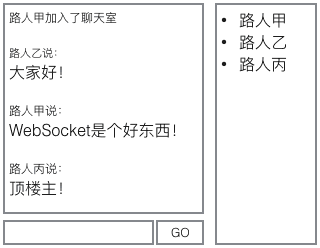

# WebSocket

WebSocket是HTML5新增的协议，它的目的是在浏览器和服务器之间建立一个不受限的双向通信的通道，比如说，服务器可以在任意时刻发送消息给浏览器。

由于HTTP协议是一个请求－响应协议，请求必须先由浏览器发给服务器，服务器才能响应这个请求，再把数据发送给浏览器。HTML5推出了WebSocket标准，让浏览器和服务器之间可以建立无限制的全双工通信，任何一方都可以主动发消息给对方。

实际上HTTP协议是建立在TCP协议之上的，TCP协议本身就实现了全双工通信，但是HTTP协议的请求－应答机制限制了全双工通信。WebSocket连接建立以后，其实只是简单规定了一下：接下来，咱们通信就不使用HTTP协议了，直接互相发数据吧。

安全的WebSocket连接机制和HTTPS类似。首先，浏览器用`wss://xxx`创建WebSocket连接时，会先通过HTTPS创建安全的连接，然后，该HTTPS连接升级为WebSocket连接，底层通信走的仍然是安全的SSL/TLS协议。

## WebSocket协议

WebSocket连接必须由浏览器发起，因为请求协议是一个标准的HTTP请求，格式如下：

```ini
GET ws://localhost:3000/ws/chat HTTP/1.1
Host: localhost
Upgrade: websocket
Connection: Upgrade
Origin: http://localhost:3000
Sec-WebSocket-Key: client-random-string
Sec-WebSocket-Version: 13
```

该请求和普通的HTTP请求有几点不同：

1. GET请求的地址不是类似`/path/`，而是以`ws://`开头的地址；
2. 请求头`Upgrade: websocket`和`Connection: Upgrade`表示这个连接将要被转换为WebSocket连接；
3. `Sec-WebSocket-Key`是用于标识这个连接，并非用于加密数据；
4. `Sec-WebSocket-Version`指定了WebSocket的协议版本。

随后，服务器如果接受该请求，就会返回如下响应：

```ini
HTTP/1.1 101 Switching Protocols
Upgrade: websocket
Connection: Upgrade
Sec-WebSocket-Accept: server-random-string
```

响应代码`101`表示本次连接的HTTP协议即将被更改，更改后的协议就是`Upgrade: websocket`指定的WebSocket协议。

版本号和子协议规定了双方能理解的数据格式，以及是否支持压缩等等。如果仅使用WebSocket的API，就不需要关心这些。

一个WebSocket连接建立成功后，浏览器和服务器就可以随时主动发送消息给对方。消息有两种，一种是文本，一种是二进制数据。通常，可以发送JSON格式的文本，这样在浏览器处理起来就十分容易。

支持WebSocket协议的主流浏览器如下：

- Chrome
- Firefox
- IE >= 10
- Sarafi >= 6
- Android >= 4.4
- iOS >= 8

## 使用ws

### ws模块

在Node.js中，使用最广泛的WebSocket模块是`ws`，依赖如下：

```json
"dependencies": {
    "ws": "1.1.1"
}
```

创建一个WebSocket的服务器实例：

```javascript
// 导入WebSocket模块:
const WebSocket = require('ws');
// 引用Server类:
const WebSocketServer = WebSocket.Server;
// 实例化:
const wss = new WebSocketServer({
    port: 3000
});
```

这样，就在3000端口上打开了一个WebSocket Server，该实例由变量`wss`引用。

接下来，如果有WebSocket请求接入，`wss`对象可以响应`connection`事件来处理这个WebSocket：

```javascript
wss.on('connection', function (ws) {
    console.log(`[SERVER] connection()`);
    ws.on('message', function (message) {
        console.log(`[SERVER] Received: ${message}`);
        ws.send(`ECHO: ${message}`, (err) => {
            if (err) {
                console.log(`[SERVER] error: ${err}`);
            }
        });
    })
});
```

在`connection`事件中，回调函数会传入一个`WebSocket`的实例，表示这个WebSocket连接。对于每个WebSocket连接，都要对它绑定某些事件方法来处理不同的事件。这里，我们通过响应`message`事件，在收到消息后再返回一个`ECHO: xxx`的消息给客户端。

### 创建WebSocket连接

创建WebSocket并且给服务器发消息的方法是在浏览器中写JavaScript代码。

打开可以执行JavaScript代码的浏览器Console，依次输入代码：

```javascript
// 打开一个WebSocket:
var ws = new WebSocket('ws://localhost:3000/test');
// 响应onmessage事件:
ws.onmessage = function(msg) { console.log(msg); };
// 给服务器发送一个字符串:
ws.send('Hello!');
```

一切正常的话，可以看到Console的输出如下：

```json
MessageEvent {isTrusted: true, data: "ECHO: Hello!", origin: "ws://localhost:3000", lastEventId: "", source: null, …}
```

这样，就在浏览器中成功地收到了服务器发送的消息！

还可以直接用`ws`模块提供的`WebSocket`来充当客户端，写法如下：

```javascript
let ws = new WebSocket('ws://localhost:3000/test');
// 打开WebSocket连接后立刻发送一条消息:
ws.on('open', function () {
    console.log(`[CLIENT] open()`);
    ws.send('Hello!');
});
// 响应收到的消息:
ws.on('message', function (message) {
    console.log(`[CLIENT] Received: ${message}`);
}
```

在Node环境下，`ws`模块的客户端可以用于测试服务器端代码，否则，每次都必须在浏览器执行JavaScript代码。

### 同源策略

WebSocket协议本身不要求同源策略（Same-origin Policy），但浏览器会发送`Origin`的HTTP头给服务器，服务器可以根据`Origin`拒绝这个WebSocket请求。

```javascript
const http = require('http');
const WebSocket = require('ws');

const server = http.createServer();
const wss = new WebSocket.Server({noServer: true});

wss.on('connection', function connection(ws, req) {
    const ip = req.connection.remoteAddress;
    const userAgent = req.headers['user-agent'];
    console.log(`[SERVER] ${ip} ${userAgent} connection()`);
    ws.on('message', function message(msg) {
        console.log(`[SERVER] Received: ${msg} from ${ip}`);
        ws.send(`ECHO: ${msg}`, (err) => {
            if (err) {
                console.log(`[SERVER] error: ${err}`);
            }
        });
    });
});

server.on('upgrade', function upgrade(request, socket, head) {
    console.log(request.headers["origin"]);
    wss.handleUpgrade(request, socket, head, function done(ws) {
        wss.emit('connection', ws, request);
    });
});

server.listen(3000);
```

## 编写聊天室

现在要基于WebSocket创建一个在线聊天室，可以把前面用koa2和Nunjucks创建的Web应用添加进来。

先创建一个完整的MVC的Web应用，结构如下：

```
ws-with-koa/
|
+- controllers/ <-- Controller
|
+- views/ <-- html模板文件
|
+- static/ <-- 静态资源文件
|
+- app.js <-- 使用koa的js
|
+- controller.js <-- 扫描注册Controller
|
+- static-files.js <-- 处理静态文件
|
+- templating.js <-- 模版引擎入口
|
+- package.json <-- 项目描述文件
|
+- node_modules/ <-- npm安装的所有依赖包
```

所需要的依赖包`package.json`：

```json
"dependencies": {
    "ws": "1.1.1",
    "koa": "2.0.0",
    "koa-bodyparser": "3.2.0",
    "koa-router": "7.0.0",
    "nunjucks": "2.4.2",
    "mime": "1.3.4",
    "mz": "2.4.0"
}
```

启动koa应用：

```javascript
const app = new Koa();
// TODO: app.use(...);
app.listen(3000);
```

 **WebSocketServer能否与 koa共用3000端口？** 

实际上，3000端口是由http模块创建的http.Server监听的，koa只是把响应函数注册到该http.Server中了。类似的，WebSocketServer也可以把自己的响应函数注册到http.Server中，这样，同一个端口，根据协议，可以分别由koa和ws处理：


把WebSocketServer绑定到同一个端口的关键代码是先获取koa创建的`http.Server`的引用，再根据`http.Server`创建WebSocketServer：

```javascript
// koa app的listen()方法返回http.Server:
let server = app.listen(3000);

// 创建WebSocketServer:
let wss = new WebSocketServer({
    server: server
});
```

WebSocketServer会首先判断请求是不是WS请求，如果是，它将处理该请求，如果不是，该请求仍由koa处理。

所以，WS请求会直接由WebSocketServer处理，它根本不会经过koa，koa的任何middleware都没有机会处理该请求。

**响应WebSocket请求时，如何识别用户身份？**

一个简单可行的方案是把用户登录后的身份写入Cookie，在koa中，可以使用middleware解析Cookie，把用户绑定到`ctx.state.user`上。

WS请求也是标准的HTTP请求，所以，服务器也会把Cookie发送过来，这样，在用WebSocketServer处理WS请求时，就可以根据Cookie识别用户身份。

先把识别用户身份的逻辑提取为一个单独的函数：

```javascript
function parseUser(obj) {
    if (!obj) {
        return;
    }
    console.log('try parse: ' + obj);
    let s = '';
    if (typeof obj === 'string') {
        s = obj;
    } else if (obj.headers) {
        let cookies = new Cookies(obj, null);
        s = cookies.get('name');
    }
    if (s) {
        try {
            let user = JSON.parse(Buffer.from(s, 'base64').toString());
            console.log(`User: ${user.name}, ID: ${user.id}`);
            return user;
        } catch (e) {
            // ignore
        }
    }
}
```

在koa的middleware中很容易识别用户：

```javascript
app.use(async (ctx, next) => {
    ctx.state.user = parseUser(ctx.cookies.get('name') || '');
    await next();
});
```

在WebSocketServer中，就需要响应`connection`事件，然后识别用户：

```javascript
wss.on('connection', function (ws) {
    // ws.upgradeReq是一个request对象:
    let user = parseUser(ws.upgradeReq);
    if (!user) {
        // Cookie不存在或无效，直接关闭WebSocket:
        ws.close(4001, 'Invalid user');
    }
    // 识别成功，把user绑定到该WebSocket对象:
    ws.user = user;
    // 绑定WebSocketServer对象:
    ws.wss = wss;
});
```

紧接着，要对每个创建成功的WebSocket绑定`message`、`close`、`error`等事件处理函数。对于聊天应用来说，每收到一条消息，就需要把该消息广播到所有WebSocket连接上。

先为`wss`对象添加一个`broadcase()`方法：

```javascript
wss.broadcast = function (data) {
    wss.clients.forEach(function (client) {
        client.send(data);
    });
};
```

在某个WebSocket收到消息后，就可以调用`wss.broadcast()`进行广播了：

```javascript
ws.on('message', function (message) {
    console.log(message);
    if (message && message.trim()) {
        let msg = createMessage('chat', this.user, message.trim());
        this.wss.broadcast(msg);
    }
});
```

消息有很多类型，不一定是聊天的消息，还可以有获取用户列表、用户加入、用户退出等多种消息。所以用`createMessage()`创建一个JSON格式的字符串，发送给浏览器，浏览器端的JavaScript就可以直接使用：

```javascript
// 消息ID:
var messageIndex = 0;

function createMessage(type, user, data) {
    messageIndex ++;
    return JSON.stringify({
        id: messageIndex,
        type: type,
        user: user,
        data: data
    });
}
```

### 编写页面

相比服务器端的代码，页面的JavaScript代码会更复杂。

聊天室页面可以划分为左侧会话列表和右侧用户列表两部分：



这里的DOM需要动态更新，因此，状态管理是页面逻辑的核心。

为了简化状态管理，可以用Vue控制左右两个列表：

```javascript
var vmMessageList = new Vue({
    el: '#message-list',
    data: {
        messages: []
    }
});

var vmUserList = new Vue({
    el: '#user-list',
    data: {
        users: []
    }
});
```

会话列表和用户列表初始化为空数组。

紧接着，创建WebSocket连接，响应服务器消息，并且更新会话列表和用户列表：

```javascript
var ws = new WebSocket('ws://localhost:3000/ws/chat');

ws.onmessage = function(event) {
    var data = event.data;
    console.log(data);
    var msg = JSON.parse(data);
    if (msg.type === 'list') {
        vmUserList.users = msg.data;
    } else if (msg.type === 'join') {
        addToUserList(vmUserList.users, msg.user);
        addMessage(vmMessageList.messages, msg);
    } else if (msg.type === 'left') {
        removeFromUserList(vmUserList.users, msg.user);
        addMessage(vmMessageList.messages, msg);
    } else if (msg.type === 'chat') {
        addMessage(vmMessageList.messages, msg);
    }
};
```

这样，JavaScript负责更新状态，Vue负责根据状态刷新DOM。以用户列表为例，HTML代码如下：

```javascript
<div id="user-list">
    <div class="media" v-for="user in users">
        <div class="media-left">
            
        </div>
        <div class="media-body">
            <h4 class="media-heading" v-text="user.name"></h4>
        </div>
    </div>
</div>
```

最终的聊天室效果如下：


### 配置反向代理

如果网站配置了反向代理，例如Nginx，则HTTP和WebSocket都必须通过反向代理连接Node服务器。HTTP的反向代理非常简单，但是要正常连接WebSocket，代理服务器必须支持WebSocket协议。

详细的配置可以参考Nginx的官方博客：[Using NGINX as a WebSocket Proxy](https://www.nginx.com/blog/websocket-nginx/)

编写一个简单的反向代理配置文件，首先要保证Nginx版本>=1.3，然后通过`proxy_set_header`指令，设定：

```
proxy_set_header Upgrade $http_upgrade;
proxy_set_header Connection "upgrade";
```

Nginx即可理解该连接将使用WebSocket协议。

一个示例配置文件内容如下：

```bash
server {
    listen      80;
    server_name localhost;
    # 处理静态资源文件:
    location ^~ /static/ {
        root /path/to/ws-with-koa;
    }
    # 处理WebSocket连接:
    location ^~ /ws/ {
        proxy_pass         http://127.0.0.1:3000;
        proxy_http_version 1.1;
        proxy_set_header   Upgrade $http_upgrade;
        proxy_set_header   Connection "upgrade";
    }
    # 其他所有请求:
    location / {
        proxy_pass       http://127.0.0.1:3000;
        proxy_set_header X-Real-IP $remote_addr;
        proxy_set_header Host $host;
        proxy_set_header X-Forwarded-For $proxy_add_x_forwarded_for;
    }
}
```

